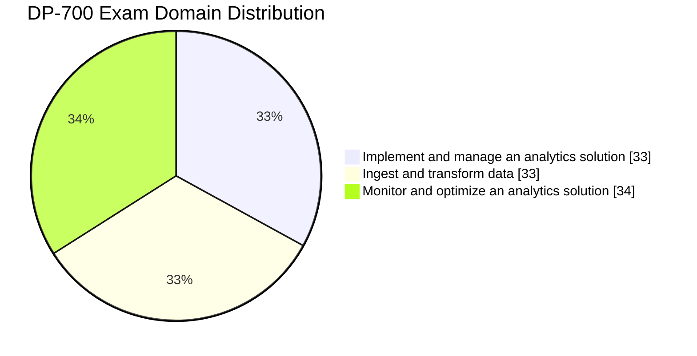

<p align="center">
  <a href="https://learn.microsoft.com/en-us/credentials/certifications/fabric-data-engineer-associate/">
    
  </a>
</p>

<h1 align="center">DP-700: Implementing Data Engineering Solutions Using Microsoft Fabric</h1>
<h3 align="center">Open-source community study guide for the Microsoft DP-700 certification</h3>

<p align="center">
  <a href="./LICENSE"></a>
  <a href="https://learn.microsoft.com/en-us/credentials/certifications/fabric-data-engineer-associate/"></a>
  <a href="https://learn.microsoft.com/en-us/credentials/certifications/resources/study-guides/dp-700"></a>
  <a href="https://www.microsoft.com/microsoft-fabric"></a>
  <br>
  <a href="#"></a>
  <a href="#"></a>
  <a href="#"></a>
  <a href="#"></a>
  <a href="#"></a>
</p>

<p align="center">
  <i>A community-maintained study guide for the <b>Microsoft DP-700: Implementing Data Engineering Solutions Using Microsoft Fabric</b> certification.<br>
  Aligned to the official skills-measured list updated <b>July 21, 2026</b>.</i>
</p>

---

## Contents

- [Why this guide exists](#why-this-guide-exists)
- [Who this is for](#who-this-is-for)
- [What's covered](#whats-covered)
- [Exam at a glance](#exam-at-a-glance)
- [July 2026 blueprint update](#july-2026-blueprint-update)
- [Getting started with Obsidian](#getting-started-with-obsidian-recommended)
- [How to use this guide](#how-to-use-this-guide)
- [Study roadmap](#study-roadmap) — 3-week, 6-week, and 10-week plans
- [Repository layout](#repository-layout)
- [Official Microsoft resources](#official-microsoft-resources)
- [Translations](#translations)
- [Contributing](#contributing)
- [License](#license)

---

## Why this guide exists

DP-700 covers the full data-engineering surface of **Microsoft Fabric** — lakehouses, warehouses, Real-Time Intelligence, orchestration, and the PySpark / T-SQL / KQL trio used to move and shape data across it. The official skills list spans three domains that shift with every Fabric release. Public study resources specific to this blueprint are scarce.

This repo is a from-scratch, community-built set of study notes, cheat sheets, practice questions, and mock exams — open-sourced under MIT so anyone preparing for DP-700 can use it, extend it, and correct it.

## Who this is for

- **Data engineers** building lakehouse and warehouse solutions in Microsoft Fabric
- **BI / analytics engineers** who need to orchestrate, secure, and monitor Fabric pipelines end-to-end
- **SQL / Spark developers** picking up KQL and Real-Time Intelligence for the first time
- **Exam takers** preparing for DP-700 specifically — every topic file maps 1:1 to the official blueprint
- **Anyone curious** about how Fabric unifies batch, streaming, and warehouse workloads on OneLake

You don't need to be taking the exam to get value — the guide doubles as a reference for OneLake shortcuts, deployment pipelines, Eventstreams, and PySpark/T-SQL/KQL transformation patterns.

## What's covered

- **11 topic sections** mapped 1:1 to the official skills measured list
- **Cheat sheets** for fast review (workspace settings, security/governance, orchestration, loading patterns, batch + streaming ingestion, monitoring/optimization)
- **Practice questions** with full explanations across all three domains
- **3 full-length mock exams** (50 questions each — 45 standalone + a 5-question case study mirroring the real exam format)
- **Per-mock debrief files** mapping every missed question to a topic file + cheat sheet
- **Hands-on lab pack** — runnable walkthroughs across lakehouse, warehouse, orchestration, and Real-Time Intelligence scenarios
- **Final review** designed to read in 20 minutes the morning of the exam
- **PySpark / T-SQL / KQL code examples** side-by-side wherever the exam tests a choice between them

## Exam at a glance

| Detail | Information |
| --- | --- |
| **Exam ID** | DP-700 |
| **Full Name** | Implementing Data Engineering Solutions Using Microsoft Fabric |
| **Credential** | Microsoft Certified: Fabric Data Engineer Associate |
| **Passing Score** | 700 / 1000 |
| **Duration** | 100 minutes |
| **Cost** | Varies by region (price shown at scheduling, via Pearson VUE) |
| **Renewal** | Annual (free Microsoft Learn assessment) |
| **Platforms tested** | Microsoft Fabric |
| **Languages (skill)** | PySpark, T-SQL, KQL |
| **Exam languages** | English, Japanese, Chinese (Simplified), German, French, Spanish, Portuguese (Brazil) |
| **Blueprint date** | July 21, 2026 |

> Question count is not published by Microsoft for this exam — don't trust "40–60 questions typical" claims you may see elsewhere; we only list what's officially confirmed.

### Domain weights



| Domain | Weight | Sections in this guide |
| :--- | :---: | :--- |
| **1. Implement and manage an analytics solution** | 30–35 % | `01` – `04` |
| **2. Ingest and transform data** | 30–35 % | `05` – `08` |
| **3. Monitor and optimize an analytics solution** | 30–35 % | `09` – `11` |

### Skills measured (verbatim, July 21, 2026)

<details>
<summary><b>Domain 1 — Implement and manage an analytics solution (30–35 %)</b></summary>

**Configure Microsoft Fabric workspace settings**

- Configure Spark workspace settings
- Configure domain workspace settings
- Configure OneLake workspace settings
- Configure Apache Airflow workspace settings

**Implement lifecycle management in Fabric**

- Configure version control
- Implement database projects
- Create and configure deployment pipelines

**Configure security and governance**

- Implement workspace-level access controls
- Implement item-level access controls
- Implement row-level, column-level, object-level, and folder/file-level access controls
- Implement dynamic data masking
- Apply sensitivity labels to items
- Endorse items
- Implement and use Microsoft Fabric audit logs
- Configure and implement OneLake security

**Orchestrate processes**

- Choose between Dataflow gen 2, a pipeline and a notebook
- Design and implement schedules and event-based triggers
- Implement orchestration patterns with notebooks and pipelines, including parameters and dynamic expressions

</details>

<details>
<summary><b>Domain 2 — Ingest and transform data (30–35 %)</b></summary>

**Design and implement loading patterns**

- Design and implement full and incremental data loads
- Prepare data for loading into a dimensional model
- Design and implement a loading pattern for streaming data

**Ingest and transform batch data**

- Choose an appropriate data store
- Choose between Dataflows Gen2, notebooks, KQL, and T-SQL for data transformation
- Create and manage OneLake shortcuts
- Implement mirroring
- Ingest data by using pipelines
- Transform data by using PySpark, SQL, and KQL
- Denormalize data
- Group and aggregate data
- Handle duplicate, missing, and late-arriving data

**Ingest and transform streaming data**

- Choose an appropriate streaming engine
- Choose between native tables and OneLake shortcuts in Real-Time Intelligence
- Choose between Query acceleration for OneLake shortcuts and standard OneLake shortcuts in Real-Time Intelligence
- Process data by using Eventstreams
- Process data by using Spark structured streaming
- Process data by using KQL
- Create windowing functions

</details>

<details>
<summary><b>Domain 3 — Monitor and optimize an analytics solution (30–35 %)</b></summary>

**Monitor Fabric items**

- Monitor data ingestion
- Monitor data transformation
- Monitor semantic model refresh
- Configure alerts

**Identify and resolve errors**

- Identify and resolve pipeline errors
- Identify and resolve Dataflow Gen2 errors
- Identify and resolve notebook errors
- Identify and resolve Eventhouse errors
- Identify and resolve Eventstream errors
- Identify and resolve T-SQL errors
- Identify and resolve OneLake shortcut errors

**Optimize performance**

- Optimize a Lakehouse table
- Optimize a pipeline
- Optimize a data warehouse
- Optimize Eventstreams and Eventhouses
- Optimize Spark performance
- Optimize query performance

</details>

## July 2026 blueprint update

> [!IMPORTANT]
> Microsoft refreshed the DP-700 skills measured on **July 21, 2026**. There is exactly **one** change versus the prior **April 20, 2026** blueprint:

- **"Configure Dataflows Gen2 workspace settings"** → **"Configure Apache Airflow workspace settings"** (within *Configure Microsoft Fabric workspace settings*, Domain 1).

Every other bullet is unchanged from the April 20, 2026 blueprint. Don't trust any source that presents other topics as "new in July" — this guide tracks the change log on the [official study guide](https://learn.microsoft.com/en-us/credentials/certifications/resources/study-guides/dp-700) directly.

The [main overview](./certification/dp-700-overview.md) opens with the full "What's New" callout.

## Getting started with Obsidian (recommended)

This guide is written in [Obsidian Flavored Markdown](https://help.obsidian.md/). It renders fine on GitHub, but in **Obsidian** you get callouts, foldable practice-question answers, Mermaid diagrams, backlinks, and a navigable Graph View of every cross-link — which makes studying meaningfully better.

### 5-minute onboarding

1. **Install [Obsidian](https://obsidian.md/download)** (free; macOS, Windows, Linux).
2. **Clone this repo** somewhere on your machine:

   ```bash
   git clone https://github.com/kengio/dp-700-study-guide.git
   cd dp-700-study-guide
   ```

3. **Open the vault**: launch Obsidian → *Open folder as vault* → pick the cloned `dp-700-study-guide/` directory.
4. **Trust the author** when Obsidian asks (the included `.obsidian/` config has pre-tuned settings — line numbers, tab width, no inline titles).
5. **Open `certification/dp-700-overview.md`** — that's your study path entry point. Press `Cmd/Ctrl + O` to fuzzy-find any topic.
6. **Toggle Graph View** (`Cmd/Ctrl + G`) to see how all 11 sections cross-link — surprisingly useful for spotting weak areas.

### Recommended plugins

Two are essential, the rest are quality-of-life. Install via **Settings → Community plugins → Browse**.

- **Obsidian Git** — back up your notes and progress checkboxes to your own fork.
- **Linter** — keeps your edits consistent with the project's markdown conventions.
- **Advanced Tables** — auto-aligns Markdown tables as you type.
- **Codeblock Customizer** (or *Better CodeBlock*) — line numbers, titles, copy buttons on code blocks.
- **Copilot** (by logancyang) — chat with Claude / GPT-4o / Ollama inside Obsidian; **Vault QA** mode indexes the guide so the AI can quiz you using your actual notes.

> 📖 **See [`OBSIDIAN-SETUP.md`](./OBSIDIAN-SETUP.md)** for the full setup walkthrough — plugin configuration details, Copilot Vault QA setup, recommended study prompts, and tips for using AI to generate active-recall questions from your notes.

### Don't want Obsidian?

No problem. The guide also renders perfectly in:

- **GitHub** — browse the files online; callouts and Mermaid diagrams render natively
- **VS Code** with the [Markdown All in One](https://marketplace.visualstudio.com/items?itemName=yzhang.markdown-all-in-one) extension
- **Any Markdown reader** that supports GFM — you'll lose callouts and Graph View, but the content is fully readable

## How to use this guide

1. **Start at the [main overview](./certification/dp-700-overview.md)** — it has the full study path and a progress tracker.
2. **Work through the 11 topic sections in order** — each topic file targets 300–600 lines with examples, comparison tables, common-mistake callouts, and exam tips.
3. **Hit the cheat sheets** after each domain to consolidate.
4. **Take the practice questions** — aim for 70 %+ per domain before moving on.
5. **Sit the mock exams under timed conditions** when you think you're close.
6. **Read `final-review.md` the morning of the exam** — it's the 20-minute scan.

## Study roadmap

Pick the plan that matches the time you have. All three end with the same outcome — sitting the exam with confidence. The hours are realistic averages for an engineer with existing SQL/Spark experience; double them if you're newer to the Fabric platform.

### 🏃 3-week sprint (~18–22 hours total)

Best for: experienced data engineers brushing up on Fabric-specific tooling. Tight but doable.

| Week | Focus | Sections | Hours |
| :--- | :--- | :--- | :---: |
| **1** | Domain 1 — Implement & manage | `01-fabric-workspace-settings`, `02-lifecycle-management`, `03-security-governance`, `04-orchestration` | 7 |
| **2** | Domain 2 — Ingest & transform | `05-loading-patterns`, `06-batch-ingestion`, `07-batch-transformation`, `08-streaming-data` | 7 |
| **3** | Domain 3 + mocks | `09-monitoring-alerting`, `10-error-resolution`, `11-performance-optimization` → practice questions → Mock Exam 1 → Mock Exam 2 → final-review.md | 7 |

### 🚶 6-week balanced (~35–45 hours total — the recommended default)

Best for: working professionals fitting study around a job.

| Week | Focus | Hours |
| :--- | :--- | :---: |
| **1** | `01-fabric-workspace-settings` + `02-lifecycle-management` + read the overview | 6 |
| **2** | `03-security-governance` + `04-orchestration` + **checkpoint:** Domain 1 cheat sheets + practice questions | 7 |
| **3** | `05-loading-patterns` + `06-batch-ingestion` | 6 |
| **4** | `07-batch-transformation` + `08-streaming-data` + **checkpoint:** Domain 2 cheat sheets + practice questions | 7 |
| **5** | `09-monitoring-alerting` + `10-error-resolution` + `11-performance-optimization` | 7 |
| **6** | Domain 3 practice questions → **Mock Exam 1 (timed)** → review weak areas → **Mock Exam 2** → **Mock Exam 3** → final-review.md | 7 |

### 🧘 10-week comprehensive (~60–75 hours total)

Best for: newcomers to Microsoft Fabric, career changers, or anyone wanting deeper retention.

| Week | Focus | Hours |
| :--- | :--- | :---: |
| **1** | `01-fabric-workspace-settings` (all sub-topics) | 6 |
| **2** | `02-lifecycle-management` + `03-security-governance` part 1 | 7 |
| **3** | `03-security-governance` part 2 + `04-orchestration` | 7 |
| **4** | **Checkpoint:** Domain 1 cheat sheets + Domain 1 practice questions (target 70 %+) | 5 |
| **5** | `05-loading-patterns` + `06-batch-ingestion` | 7 |
| **6** | `07-batch-transformation` | 6 |
| **7** | `08-streaming-data` + Domain 2 practice questions | 7 |
| **8** | `09-monitoring-alerting` + `10-error-resolution` | 6 |
| **9** | `11-performance-optimization` + Domain 3 practice questions | 6 |
| **10** | **Mock Exam 1** → gap-fill → **Mock Exam 2** → **Mock Exam 3** → final-review.md → exam | 8 |

### Suggested daily cadence

```text
Weekday    (45–60 min):  Read 1 topic sub-file + work the examples in your own workspace
Weekend    (90–120 min): Cheat sheet review + practice questions
Pre-exam   (last 3 days): Stop new material. Re-read cheat sheets and final-review.md only.
Exam day:                Read final-review.md once over coffee. Eat. Go pass it.
```

## Repository layout

```text
dp-700-study-guide/
├── certification/
│   ├── dp-700-overview.md              # main entry point — start here
│   ├── 01-fabric-workspace-settings/   # Spark, domain, OneLake, Airflow workspace settings
│   ├── 02-lifecycle-management/        # version control, database projects, deployment pipelines
│   ├── 03-security-governance/         # workspace/item access, granular controls, OneLake security
│   ├── 04-orchestration/               # tool choice, schedules/triggers, orchestration patterns
│   ├── 05-loading-patterns/            # full/incremental loads, dimensional model, streaming loads
│   ├── 06-batch-ingestion/             # data store choice, OneLake shortcuts, mirroring, pipelines
│   ├── 07-batch-transformation/        # transform tool choice, PySpark/T-SQL/KQL, data quality
│   ├── 08-streaming-data/              # streaming engine choice, Eventstreams, Spark streaming, KQL
│   ├── 09-monitoring-alerting/         # monitoring surfaces, semantic model refresh, alerts
│   ├── 10-error-resolution/            # pipeline/notebook/T-SQL/real-time/shortcut errors
│   ├── 11-performance-optimization/    # lakehouse, warehouse, Spark, real-time, pipeline optimization
│   └── resources/
│       ├── cheat-sheets/               # quick-reference for exam day
│       ├── practice-questions/         # per-domain Q&A
│       ├── mock-exam/ mock-exam-2/ mock-exam-3/  # three full mock exams
│       ├── labs/                       # runnable hands-on labs
│       ├── code-examples/{pyspark,tsql,kql}/  # standalone code examples
│       ├── appendix/                   # glossary, comparisons, error reference
│       ├── anki/                       # spaced-repetition deck
│       └── final-review.md, exam-tips.md, official-links.md, companion-exams.md, renewal-guide.md
├── practice/                            # adaptive practice quiz — HTML/JS/CSS + build.py + JSON banks
│                                        # auto-deployed to GitHub Pages
├── i18n/                                # community translations — parallel tree per locale
├── .github/workflows/                   # CI: markdownlint + lychee (lint.yml), Pages deploy (deploy-practice.yml)
├── CHANGELOG.md                         # versioned change log
├── CONTRIBUTING.md / CONTRIBUTORS.md    # contribution guide and roster
├── TRANSLATING.md                       # translation conventions
├── LICENSE                              # MIT
└── README.md                            # this file
```

## Official Microsoft resources

<details>
<summary><b>📋 Exam and certification</b></summary>

### Exam and certification

- [DP-700 skills measured (official study guide)](https://learn.microsoft.com/en-us/credentials/certifications/resources/study-guides/dp-700)
- [Fabric Data Engineer Associate certification page](https://learn.microsoft.com/en-us/credentials/certifications/fabric-data-engineer-associate/)
- [Schedule the exam](https://learn.microsoft.com/en-us/credentials/certifications/schedule-through-pearson-vue?examUid=exam.DP-700)
- [Free Microsoft Learn practice assessment](https://learn.microsoft.com/en-us/credentials/certifications/fabric-data-engineer-associate/practice/assessment?assessment-type=practice&assessmentId=1704375541&practice-assessment-type=certification)
- [Exam sandbox (try the testing UI)](https://aka.ms/examdemo)
- [Request accommodations](https://learn.microsoft.com/en-us/credentials/certifications/request-accommodations)

</details>

<details>
<summary><b>📚 Documentation by topic</b></summary>

### Documentation by topic

- [Microsoft Fabric documentation](https://learn.microsoft.com/en-us/fabric/)
- [What is Data engineering in Microsoft Fabric?](https://learn.microsoft.com/en-us/fabric/data-engineering/data-engineering-overview)
- [OneLake overview](https://learn.microsoft.com/en-us/fabric/onelake/onelake-overview)
- [OneLake shortcuts](https://learn.microsoft.com/en-us/fabric/onelake/onelake-shortcuts)
- [Lakehouse overview](https://learn.microsoft.com/en-us/fabric/data-engineering/lakehouse-overview)
- [Data warehouse in Microsoft Fabric](https://learn.microsoft.com/en-us/fabric/data-warehouse/data-warehousing)
- [Fabric deployment pipelines](https://learn.microsoft.com/en-us/fabric/cicd/deployment-pipelines/intro-to-deployment-pipelines)
- [Fabric Git integration (version control)](https://learn.microsoft.com/en-us/fabric/cicd/git-integration/intro-to-git-integration)
- [Apache Airflow job in Fabric](https://learn.microsoft.com/en-us/fabric/data-factory/apache-airflow-jobs-concepts)
- [Data pipelines in Fabric](https://learn.microsoft.com/en-us/fabric/data-factory/pipeline-orchestration-data-pipelines)
- [Dataflow Gen2 overview](https://learn.microsoft.com/en-us/fabric/data-factory/dataflows-gen2-overview)
- [Mirroring in Microsoft Fabric](https://learn.microsoft.com/en-us/fabric/mirroring/overview)
- [Real-Time Intelligence overview](https://learn.microsoft.com/en-us/fabric/real-time-intelligence/overview)
- [Eventstreams overview](https://learn.microsoft.com/en-us/fabric/real-time-intelligence/event-streams/overview)
- [Kusto Query Language (KQL) overview](https://learn.microsoft.com/en-us/kusto/query/?view=microsoft-fabric)
- [Spark structured streaming in Fabric](https://learn.microsoft.com/en-us/fabric/data-engineering/lakehouse-notebook-load-data-overview)
- [Row-level security in Fabric](https://learn.microsoft.com/en-us/fabric/data-warehouse/row-level-security)
- [Dynamic data masking in Fabric](https://learn.microsoft.com/en-us/fabric/data-warehouse/dynamic-data-masking)
- [OneLake security](https://learn.microsoft.com/en-us/fabric/onelake/security/onelake-data-access-control-model)
- [Monitoring hub in Fabric](https://learn.microsoft.com/en-us/fabric/admin/monitoring-hub)
- [Fabric database projects (SQL projects)](https://learn.microsoft.com/en-us/fabric/data-warehouse/database-project)

</details>

<details>
<summary><b>👥 Community and learning paths</b></summary>

### Community and learning paths

- [Microsoft Learn — DP-700 learning path](https://learn.microsoft.com/en-us/training/browse/?terms=DP-700)
- [Microsoft Q&A](https://learn.microsoft.com/en-us/answers/products/)
- [Analytics on Azure Tech Community](https://techcommunity.microsoft.com/t5/analytics-on-azure/bd-p/AnalyticsonAzureDiscussion)
- [Microsoft Fabric Blog](https://www.microsoft.com/microsoft-fabric/blog/)
- [Data Exposed (video series)](https://learn.microsoft.com/en-us/shows/data-exposed/)
- [Exam Readiness Zone](https://learn.microsoft.com/en-us/shows/exam-readiness-zone/)

</details>

## Translations

The English content under `certification/` is canonical. Community translations live in `i18n/<locale>/` as parallel trees and don't alter the English source.

- **Available locales** — see [`i18n/README.md`](./i18n/README.md) (none yet — be the first!)
- **How to translate** — read [`TRANSLATING.md`](./TRANSLATING.md) for BCP-47 locale codes, layout, priority order, and the currency policy
- **Coordinate first** — open an issue titled `i18n: <locale name>` so two people don't start the same locale in parallel

## Contributing

Found an error, a stale link, or a topic that needs deeper coverage? PRs are welcome.

- **Small fixes** (typos, link rot, factual corrections) — open a PR directly
- **New practice questions or topic expansions** — open an issue first to discuss scope
- **Blueprint changes** — Microsoft updates DP-700 periodically; PRs that bring sections in line with the latest skills-measured list are especially appreciated

Please keep the existing structure: each topic file follows the conventions in [`CLAUDE.md`](./CLAUDE.md), and code examples live in `certification/resources/code-examples/{pyspark,tsql,kql}/`. See [`CONTRIBUTING.md`](./CONTRIBUTING.md) for the full guide.

## License

Released under the [MIT License](./LICENSE). Use, fork, remix, redistribute — just keep the copyright notice.

---

<p align="center">
  <i>This guide is a community resource. It is <b>not</b> affiliated with, endorsed by, or sponsored by Microsoft.<br>
  "Microsoft", "Azure", "Microsoft Fabric", and related marks are trademarks of Microsoft Corporation.<br>
  Always verify against the official <a href="https://learn.microsoft.com/en-us/credentials/certifications/resources/study-guides/dp-700">DP-700 skills measured</a> page — it is the source of truth.</i>
</p>
