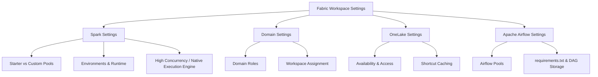

# Fabric Workspace Settings (Domain 1 · 30–35%)

Configuring a Fabric workspace correctly is the foundation everything else in Domain 1 builds on: Spark compute behavior, domain-based governance, OneLake access and caching, and the newly blueprint-tested Apache Airflow job runtime all live under **Workspace settings**.

---

## Quick Recall

```mermaid
mindmap
  root((Workspace Settings))
    Spark
      Starter pool - 5-10s, Medium only
      Custom pool - Admin + capacity toggle
      Runtime 1.3 GA / 2.0 preview
      High concurrency - 5 default, 50 max
      Native execution engine - preview, auto fallback
    Domains
      Fabric admin / Domain admin / Contributor
      Assign by name / admin / capacity
      Default domain - fills gaps only
      Delegated settings - label, certification
    OneLake
      External app access toggle
      Shortcut cache - GCS/S3/S3-compat/OPDG only
      1-28 day retention, 1GB file cap
      File explorer - placeholder sync
    Airflow
      "Replaced Dataflows Gen2 bullet (Jul 2026)"
      Starter vs custom pool
      dags folder vs plugins folder
      No Free/PPU workspace support
```

---

## Topics Overview



## Section Contents

| File | Topic | Priority |
| :--- | :--- | :--- |
| [01-spark-settings.md](01-spark-settings.md) | Starter/custom pools, autoscale, environments, runtime versions, high concurrency, native execution engine | High |
| [02-domain-settings.md](02-domain-settings.md) | Domains/subdomains, domain roles, workspace assignment, default domain, delegated settings | High |
| [03-onelake-settings.md](03-onelake-settings.md) | OneLake availability, external access, shortcut caching, diagnostics, file explorer implications | High |
| [04-airflow-settings.md](04-airflow-settings.md) | Apache Airflow job pools, requirements.txt, DAG file storage — the July 2026 blueprint addition | High |

## Key Concepts

- **Starter vs. Custom Pool**: the recurring compute pattern across both Spark and Apache Airflow job — Microsoft-managed instant compute vs. admin-configured, always-on compute
- **Environment (Spark)**: the reusable item bundling Spark compute, libraries, and resources; can be promoted to workspace default
- **Domain Roles**: Fabric admin > domain admin > domain contributor, each with strictly narrower scope
- **Shortcut Caching**: workspace-level, source-restricted (GCS/S3/S3-compatible/OPDG only) performance and egress-cost optimization
- **Apache Airflow Job**: Fabric's managed Airflow runtime, the July 21, 2026 blueprint's sole Domain 1 wording change (replacing the Dataflows Gen2 workspace-settings bullet)

## Related Resources

- [02-Lifecycle Management](../02-lifecycle-management/lifecycle-management.md)
- [03-Security & Governance](../03-security-governance/security-governance.md)
- [Official: Microsoft Fabric documentation](https://learn.microsoft.com/en-us/fabric/)
- [Official: DP-700 skills measured](https://learn.microsoft.com/en-us/credentials/certifications/resources/study-guides/dp-700)

---

**[↑ Back to Certification](../dp-700-overview.md) | [Next →](../02-lifecycle-management/lifecycle-management.md)**
