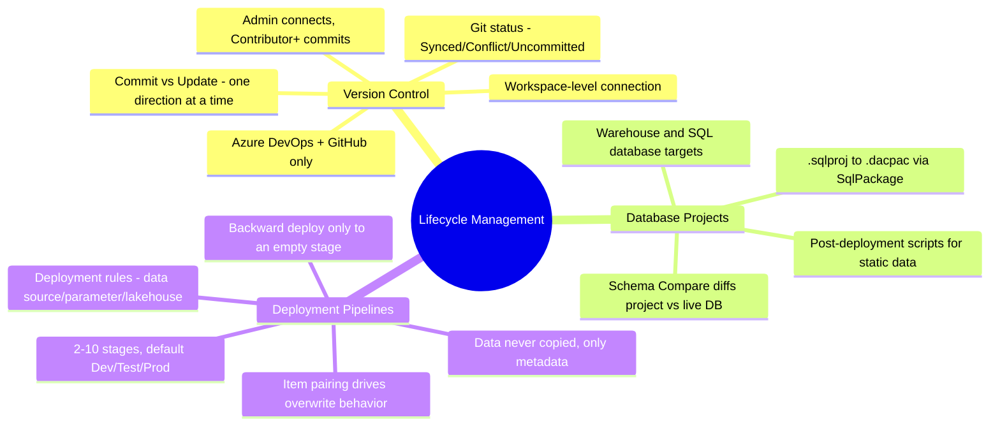
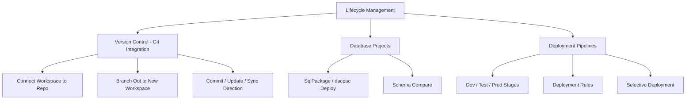

# Lifecycle Management (Domain 1 · 30–35%)

Fabric's Application Lifecycle Management (ALM) toolset spans three layers that work together but solve different problems: **Git integration** version-controls workspace items, **SQL database projects** version-control declarative database schema at the object level, and **deployment pipelines** promote content across dev/test/prod stages. Domain 1 tests whether you know which tool solves which problem and how they interact.

---

## Quick Recall

---

## Topics Overview

## Section Contents

| File | Topic | Priority |
| :--- | :--- | :--- |
| [01-version-control.md](01-version-control.md) | Git integration: supported providers, connecting a workspace, branching out, commit/update/sync direction, supported items, conflict resolution, Git status indicators, permissions, limitations | High |
| [02-database-projects.md](02-database-projects.md) | SQL database projects: SqlPackage/dacpac deployment, Schema Compare, when to use vs. deployment pipelines, warehouse/SQL database integration | High |
| [03-deployment-pipelines.md](03-deployment-pipelines.md) | Deployment pipelines: stages, workspace assignment, comparing content, deployment rules, selective deployment, pipeline access vs. workspace roles, what does and doesn't get deployed | High |

## Key Concepts

- **Git integration** is workspace-scoped source control against Azure DevOps or GitHub — it versions item *definitions*, never data
- **SQL database projects** are the declarative, `.sqlproj`-based schema representation that Fabric auto-generates for Warehouse and SQL database items the moment they're committed to Git
- **Deployment pipelines** move content between up to 10 named stages (2 minimum), using **item pairing** to decide whether a deploy overwrites or duplicates
- **Deployment rules** (data source, parameter, default lakehouse) let a target stage keep stage-specific configuration across repeated deployments — but only for a narrow, specific set of item types
- **Data is never copied** by either Git integration or deployment pipelines — only item metadata/schema. Refresh or reload data manually after any promotion

## Related Resources

- [01-Fabric Workspace Settings](../01-fabric-workspace-settings/fabric-workspace-settings.md)
- [03-Security & Governance](../03-security-governance/security-governance.md)
- [Official: Git integration overview](https://learn.microsoft.com/en-us/fabric/cicd/git-integration/intro-to-git-integration)
- [Official: Deployment pipelines overview](https://learn.microsoft.com/en-us/fabric/cicd/deployment-pipelines/intro-to-deployment-pipelines)
- [Official: DP-700 skills measured](https://learn.microsoft.com/en-us/credentials/certifications/resources/study-guides/dp-700)

---

**[← Previous](../01-fabric-workspace-settings/fabric-workspace-settings.md) | [↑ Back to Certification](../dp-700-overview.md) | [Next →](../03-security-governance/security-governance.md)**
