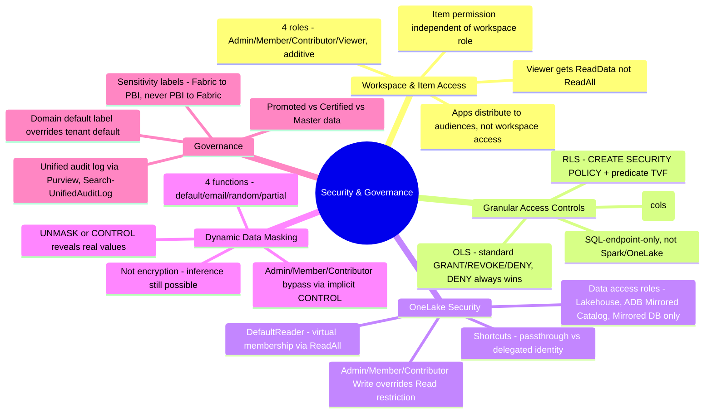
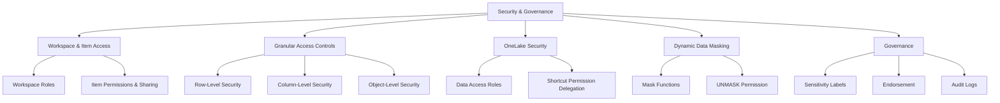

# Security & Governance (Domain 1 · 30–35%)

Fabric secures data through layered, independently-evaluated mechanisms: **workspace roles** and **item permissions** control who can reach an item at all; **RLS/CLS/OLS** and **OneLake data access roles** narrow what they see once inside; **dynamic data masking** obscures sensitive values for display; and **sensitivity labels, endorsement, and audit logs** govern classification, trust, and accountability across the whole tenant. Domain 1 tests whether you know which layer solves which problem, and how they combine — or silently fail to — in a given scenario.

---

## Quick Recall

---

## Topics Overview

## Section Contents

| File | Topic | Priority |
| :--- | :--- | :--- |
| [01-workspace-item-access.md](01-workspace-item-access.md) | Workspace roles (Admin/Member/Contributor/Viewer) capability matrix, item-level permissions and sharing, SQL analytics endpoint access, app audiences vs. direct sharing | High |
| [02-granular-access-controls.md](02-granular-access-controls.md) | RLS/CLS/OLS in Fabric Warehouse and SQL analytics endpoint, DDM interplay, OneLake folder/file control, decision matrix by layer | High |
| [03-onelake-security.md](03-onelake-security.md) | OneLake data access roles, DefaultReader, folder scoping, interaction with workspace roles/item permissions/shortcuts, GA/preview status by engine | High |
| [04-dynamic-data-masking.md](04-dynamic-data-masking.md) | DDM mask functions, `ALTER TABLE ... ADD MASKED`, `GRANT UNMASK`, masking vs. encryption | High |
| [05-governance.md](05-governance.md) | Sensitivity labels and inheritance, endorsement (Promoted/Certified/Master data), Fabric unified audit logs | High |

## Key Concepts

- **Two independent access layers** — workspace role and item permission — both gate access; removing one doesn't remove access still held via the other
- **Granular SQL controls (RLS/CLS/OLS)** apply only within the Warehouse/SQL analytics endpoint; **OneLake data access roles** are the equivalent for Spark/OneLake API access, and are the only way to get one restriction enforced consistently across engines
- **DDM masks values, not access** — it's complementary to RLS/CLS/OLS, and Fabric workspace Admin/Member/Contributor bypass it by default via implicit `CONTROL`
- **Sensitivity label inheritance is directional**: Fabric → Fabric and Fabric → Power BI both work; Power BI → Fabric does not
- **Endorsement is tiered by authorization**: Promoted needs only write permission; Certified and Master data both require tenant-admin-designated reviewer status

## Related Resources

- [02-Lifecycle Management](../02-lifecycle-management/lifecycle-management.md)
- [04-Orchestration](../04-orchestration/orchestration.md)
- [Official: Roles in workspaces in Microsoft Fabric](https://learn.microsoft.com/en-us/fabric/fundamentals/roles-workspaces)
- [Official: OneLake security access control model](https://learn.microsoft.com/en-us/fabric/onelake/security/data-access-control-model)
- [Official: DP-700 skills measured](https://learn.microsoft.com/en-us/credentials/certifications/resources/study-guides/dp-700)

---

**[← Previous](../02-lifecycle-management/lifecycle-management.md) | [↑ Back to Certification](../dp-700-overview.md) | [Next →](../04-orchestration/orchestration.md)**
