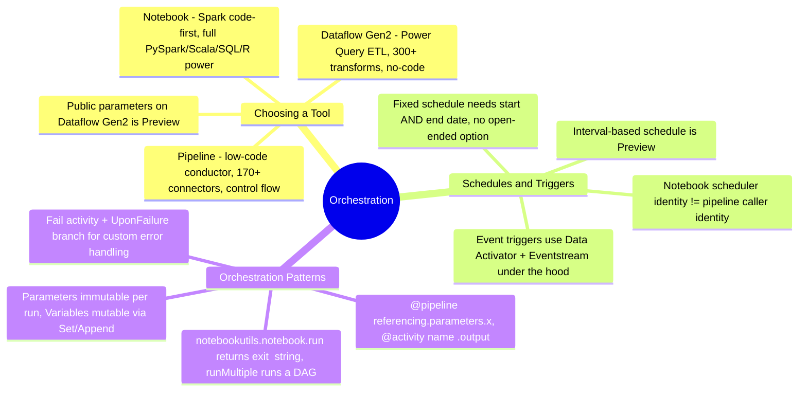
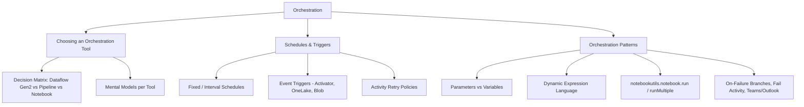

# Orchestration (Domain 1 · 30–35%)

Orchestration is how Fabric turns individual data items — a Dataflow Gen2, a notebook, a Copy activity — into a coordinated, schedulable, monitorable workflow. Domain 1 tests three overlapping skills here: **choosing the right authoring surface** for a given transform (Dataflow Gen2 vs. pipeline vs. notebook), **triggering work correctly** (time-based schedules vs. event-based triggers via Activator), and **wiring activities together** with parameters, dynamic expressions, parent-child pipeline calls, and error-handling branches. Getting the tool choice wrong, or missing a retry/failure path, is one of the most common exam trap patterns in this domain.

---

## Quick Recall

---

## Topics Overview

## Section Contents

| File | Topic | Priority |
| :--- | :--- | :--- |
| [01-choosing-orchestration-tool.md](01-choosing-orchestration-tool.md) | Decision matrix for Dataflow Gen2 vs. pipeline vs. notebook — authoring skill, connectors, transform power, cost model, git support, parameterization; worked scenarios | High |
| [02-schedules-triggers.md](02-schedules-triggers.md) | Pipeline fixed/interval schedules, time zones, event-based triggers via Activator (OneLake + Azure Blob events), notebook/Dataflow Gen2 scheduling, trigger monitoring, activity retry policies | High |
| [03-orchestration-patterns.md](03-orchestration-patterns.md) | Pipeline parameters/variables, `@pipeline()`/`@activity()` expression language, Invoke Pipeline and Notebook activity parameter passing, `notebookutils.notebook.run`/`runMultiple` DAGs, parent-child patterns, error handling paths | High |

## Key Concepts

- **Three orchestration surfaces, one workspace** — Dataflow Gen2 (Power Query, no-code transform), pipelines (low-code control flow + scheduling + triggers), and notebooks (Spark code-first) aren't mutually exclusive; a real solution typically composes all three via pipeline activities
- **Two ways to start a run**: time-based (fixed schedule requiring a start *and* end date, or preview interval-based schedules) and event-based (storage/OneLake/Blob events and Fabric/Azure events routed through Data Activator and an underlying eventstream)
- **Identity matters for who runs what** — a notebook run via a pipeline activity executes as the *pipeline's last-modified user*; a notebook run via its own schedule executes as whoever *created or last updated that schedule* — these are different security contexts even for the same notebook
- **Parameters are read-only per run; variables are mutable** — pipeline parameters are set once at trigger time and can't change mid-run, while `Set Variable`/`Append Variable` activities let you mutate pipeline-scoped variables as the run progresses
- **`notebookutils.notebook.run`/`runMultiple`** give code-first parent-child orchestration inside Spark, complementary to (not a replacement for) the pipeline's Invoke Pipeline activity — `runMultiple` supports a full DAG with dependencies, retries, and concurrency control

## Related Resources

- [01-Fabric Workspace Settings](../01-fabric-workspace-settings/fabric-workspace-settings.md)
- [03-Security & Governance](../03-security-governance/security-governance.md)
- [05-Loading Patterns](../05-loading-patterns/loading-patterns.md)
- [Official: What is Data Factory in Microsoft Fabric](https://learn.microsoft.com/en-us/fabric/data-factory/data-factory-overview)
- [Official: Run, schedule, or use events to trigger a pipeline](https://learn.microsoft.com/en-us/fabric/data-factory/pipeline-runs)
- [Official: DP-700 skills measured](https://learn.microsoft.com/en-us/credentials/certifications/resources/study-guides/dp-700)

---

**[← Previous](../03-security-governance/security-governance.md) | [↑ Back to Certification](../dp-700-overview.md) | [Next →](../05-loading-patterns/loading-patterns.md)**
