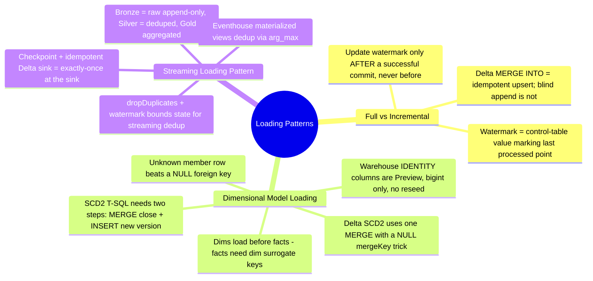
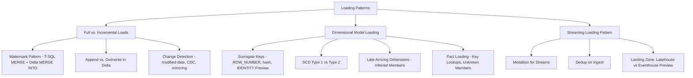

# Loading Patterns (Domain 2 · 30–35%)

Loading patterns are the mechanics of getting data into a Fabric warehouse or lakehouse correctly, repeatedly, and without duplicating or losing rows. Domain 2 tests three overlapping skills here: **choosing full vs. incremental loads** and implementing the watermark pattern that makes incremental loads reliable, **preparing and loading dimensional models** (surrogate keys, SCD1/SCD2, late-arriving dimensions, fact-table lookups), and **applying loading patterns to streaming data** (medallion architecture for streams, append-only ingestion, dedup on ingest). Getting idempotency wrong — a load that produces different results if it's accidentally run twice — is one of the most common exam trap patterns in this domain.

---

## Quick Recall

---

## Topics Overview

## Section Contents

| File | Topic | Priority |
| :--- | :--- | :--- |
| [01-full-incremental-loads.md](01-full-incremental-loads.md) | Full vs. incremental load decision factors, the watermark pattern (T-SQL MERGE and PySpark Delta `MERGE INTO` side by side), append vs. overwrite semantics in Delta, idempotency, change detection options | High |
| [02-dimensional-model-loading.md](02-dimensional-model-loading.md) | Star schema loading order, surrogate key generation (`ROW_NUMBER`, hash keys, `IDENTITY` Preview, `monotonically_increasing_id` caveats), SCD Type 1/2 in T-SQL and PySpark, late-arriving dimensions, fact-table loading and unknown members | High |
| [03-streaming-loading-pattern.md](03-streaming-loading-pattern.md) | Medallion architecture for streams, append-only ingestion, dedup on ingest (watermark + `dropDuplicates`, Eventhouse materialized views), landing-zone patterns, micro-batch vs. continuous, exactly-once vs. at-least-once | High |

## Key Concepts

- **A watermark is a durable pointer, not a variable** — it lives in a control table (or a small Delta table) and is only advanced *after* a load commits successfully, so a failed run can safely retry from the last known-good point
- **`MERGE` is the idempotency mechanism** — both T-SQL `MERGE` (Warehouse) and Delta `MERGE INTO` (Lakehouse) key on a business/natural key, so re-running the same batch upserts instead of duplicating rows; naive `INSERT`/append does not have this property
- **Dimensions load before facts** — a fact row needs a dimension's surrogate key to exist (or an inferred placeholder) before it can be loaded with a valid foreign key
- **Fabric Warehouse `IDENTITY` columns are Preview** (verified against Microsoft Learn, July 2026) — `bigint`-only, no custom seed/increment, can't `ALTER TABLE ADD` an `IDENTITY` column to an existing table; `ROW_NUMBER()`-based and hash-based surrogate keys remain the exam-relevant fallback patterns
- **Streaming loads default to append-only** — bronze and most silver-layer streaming writes use `outputMode("append")`; upserts and aggregation happen in a downstream micro-batch (`foreachBatch` + `MERGE`) or in an Eventhouse materialized view, not directly in the streaming write itself

## Related Resources

- [04-Orchestration](../04-orchestration/orchestration.md)
- [06-Batch Ingestion](../06-batch-ingestion/batch-ingestion.md)
- [08-Streaming Data](../08-streaming-data/streaming-data.md)
- [Official: Ingest data into the Warehouse](https://learn.microsoft.com/en-us/fabric/data-warehouse/ingest-data)
- [Official: Lakehouse and Delta tables](https://learn.microsoft.com/en-us/fabric/data-engineering/lakehouse-and-delta-tables)
- [Official: DP-700 skills measured](https://learn.microsoft.com/en-us/credentials/certifications/resources/study-guides/dp-700)

---

**[← Previous](../04-orchestration/orchestration.md) | [↑ Back to Certification](../dp-700-overview.md) | [Next →](../06-batch-ingestion/batch-ingestion.md)**
