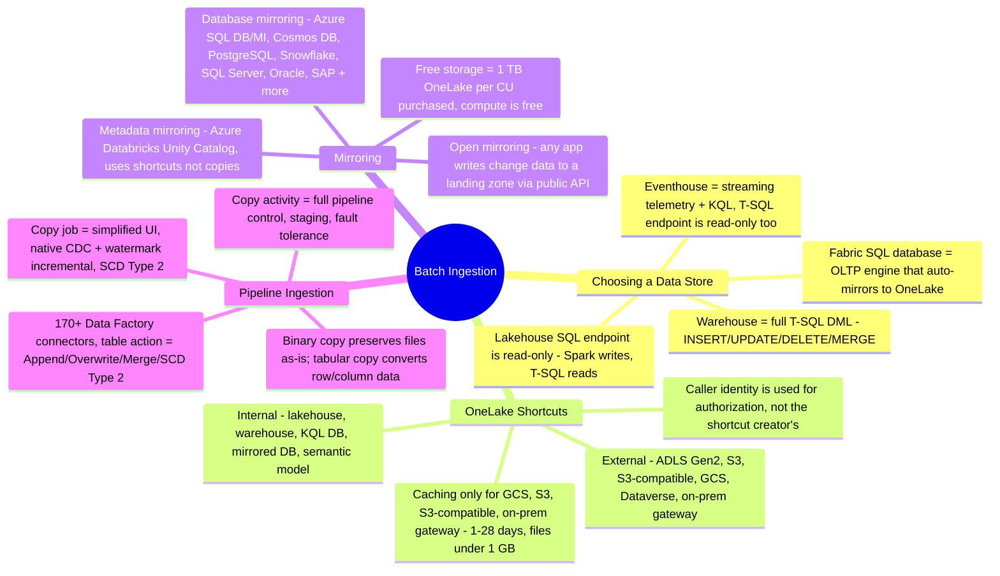
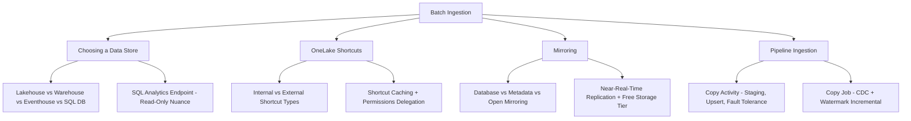

# Batch Ingestion (Domain 2 · 30–35%)

Batch ingestion is the domain where a data engineer decides *where data lands* and *how it gets there*. Domain 2 tests four overlapping skills here: **choosing the right Fabric data store** for a workload (lakehouse, warehouse, eventhouse, or Fabric SQL database), **using OneLake shortcuts** to reference data without copying it, **using Database Mirroring** to continuously replicate operational sources into OneLake with near-zero ETL, and **building pipeline-based ingestion** with Copy activity and Copy job for the scenarios that genuinely need data movement. The exam consistently rewards recognizing when *not* to copy data — shortcuts and mirroring exist specifically to avoid the pipelines this section also teaches you to build.

---

## Quick Recall

---

## Topics Overview

## Section Contents

| File | Topic | Priority |
| :--- | :--- | :--- |
| [01-choosing-data-store.md](01-choosing-data-store.md) | The data store decision matrix — lakehouse vs. warehouse vs. eventhouse vs. Fabric SQL database by workload, language surface, latency, streaming fit, and consumer type; SQL analytics endpoint read-only nuance; when Fabric SQL database sneaks into a DE scenario | High |
| [02-onelake-shortcuts.md](02-onelake-shortcuts.md) | Internal and external shortcut types, creation and permissions delegation model, shortcut caching, shortcuts vs. copying data, and shortcut behavior across Spark, the SQL analytics endpoint, and semantic models | High |
| [03-mirroring.md](03-mirroring.md) | Database mirroring flavors (Azure SQL, Cosmos DB, Snowflake, PostgreSQL, SQL Server, and more), metadata mirroring (Azure Databricks Unity Catalog), open mirroring, near-real-time replication mechanics, the free storage allowance, and mirroring vs. shortcuts vs. pipeline copy | High |
| [04-pipeline-ingestion.md](04-pipeline-ingestion.md) | Copy activity deep-dive (source/sink pairs, staging, upsert, partitioning, fault tolerance), the Copy job item and how it differs, the Data Factory connector ecosystem, file formats and compression, and pipeline vs. `COPY INTO` vs. Dataflow ingestion | High |

## Key Concepts

- **The data store decision is a language-surface decision as much as a workload decision** — a lakehouse's SQL analytics endpoint is read-only (`SELECT` only); a warehouse gives full T-SQL DML (`INSERT`/`UPDATE`/`DELETE`/`MERGE`). A scenario that says "the team needs to write T-SQL `UPDATE` statements against this data" is describing a warehouse, not a lakehouse, even if the team is otherwise Spark-heavy
- **Shortcuts avoid a copy; mirroring avoids a pipeline** — both exist to eliminate ETL for a specific situation: shortcuts when data already lives somewhere queryable, mirroring when a source database needs to be continuously and automatically kept in sync with OneLake
- **Mirroring storage is free up to a capacity-based limit** — one free terabyte of OneLake storage per purchased capacity unit (CU), covering the vast majority of mirrored workloads without incurring OneLake storage charges
- **Copy job adds CDC-based incremental replication and SCD Type 2 on top of what Copy activity offers** — Copy activity is the general-purpose, pipeline-embedded data mover; Copy job is a simplified, standalone item purpose-built for bulk, incremental, and CDC-driven data movement without hand-building watermark logic
- **The store choice cascades into transform tool and streaming engine** — see [The Domain 2 Decision Spine](01-choosing-data-store.md#the-domain-2-decision-spine-store-transform-streaming) for how lakehouse/warehouse/eventhouse/Fabric SQL database each determine their native transform surface and streaming role

## Related Resources

- [05-Loading Patterns](../05-loading-patterns/loading-patterns.md)
- [07-Batch Transformation](../07-batch-transformation/batch-transformation.md)
- [Official: Fabric decision guide — choose a data store](https://learn.microsoft.com/en-us/fabric/fundamentals/decision-guide-data-store)
- [Official: OneLake shortcuts](https://learn.microsoft.com/en-us/fabric/onelake/onelake-shortcuts)
- [Official: Mirroring in Fabric](https://learn.microsoft.com/en-us/fabric/mirroring/overview)
- [Official: DP-700 skills measured](https://learn.microsoft.com/en-us/credentials/certifications/resources/study-guides/dp-700)

---

**[← Previous](../05-loading-patterns/loading-patterns.md) | [↑ Back to Certification](../dp-700-overview.md) | [Next →](../07-batch-transformation/batch-transformation.md)**
