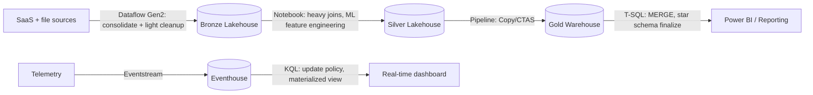

# Choosing a Transform Tool

## Overview

Microsoft Fabric gives you four distinct surfaces for transforming data: **Dataflow Gen2** (low-code, Power Query), **notebooks** (code-first, Spark), **KQL** (Kusto Query Language, Eventhouse-native), and **T-SQL** (warehouse-native). All four can shape, clean, and reshape data — the exam's "choose an appropriate method for performing data transformations" family of questions tests whether you can match a scenario's skillset, data volume, source/sink shape, and DML requirement to the right one. This topic builds that decision matrix, then walks through worked scenarios and the distractor patterns the exam likes to plant.

> [!abstract]
>
> - **Dataflow Gen2** = low-code, Power Query M, best for analysts and low-to-medium data volumes with many varied sources
> - **Notebook (PySpark/Spark SQL)** = code-first, scales out via Spark, best for TB-scale data, custom logic, and ML
> - **KQL** = purpose-built for telemetry/time-series aggregation inside an Eventhouse, not a general-purpose batch transform tool
> - **T-SQL** = SQL-first, warehouse-resident, full DML — best when the team and the data both live in SQL

> [!tip] What the Exam Tests
>
> - Matching a scenario's skillset (analyst vs. data engineer vs. SQL developer), data volume, and source count to the correct tool
> - Recognizing that KQL's transformation role is scoped to Eventhouse/real-time workloads, not general batch ETL
> - Spotting when "low-code" is the deciding signal (Dataflow Gen2) vs. when "TB-scale custom joins" is (notebook/Spark)
> - Choosing T-SQL specifically when the data already lives in a warehouse and the team is SQL-only

---

## The Decision Matrix

| Factor | Dataflow Gen2 | Notebook (PySpark/Spark SQL) | KQL (Eventhouse) | T-SQL (Warehouse) |
| :--- | :--- | :--- | :--- | :--- |
| **Skill profile** | Low-code — Power Query M; analysts and citizen integrators | Code-first — Python/Scala/Spark SQL; data engineers | KQL syntax; real-time/telemetry analysts, SREs | SQL-first; DBA/BI developers, SQL Server background |
| **Data volume / scale-out** | Low to medium — hundreds of MB to low tens of GB comfortably; no manual scale-out control | ==Low to high== — scales via the Spark cluster/pool; the tool of choice for TB-scale joins and custom partitioning | Purpose-built for high-volume streaming/time-series ingestion and query, not general batch ETL volume | Low to high — scales via warehouse compute; strong for large, SQL-shaped batch loads, weak for unstructured data |
| **Source/sink targets** | ==150+== Power Query connectors; writes to lakehouse, Azure SQL DB, Azure Data Explorer, Synapse | Any OneLake table, external files, anything reachable from Spark libraries/APIs | Ingests from Eventstream, ADX, storage; queries KQL DB/Eventhouse tables | Reads/writes warehouse tables with full DML; lakehouse SQL analytics endpoint is read-only |
| **Transform expressiveness** | Visual, ==300+== prebuilt M transformation functions; limited custom code | Full general-purpose language — arbitrary logic, ML, custom libraries, UDFs | Rich analytical operators (`summarize`, `extend`, `parse`) but not a general-purpose programming language | Full T-SQL DML/DDL, window functions, CTEs — set-based, no native procedural loops outside T-SQL scripting |
| **Cost/compute model** | Consumption-based on Dataflow refresh (CU); can get expensive at scale or with frequent refresh | Spark pool consumption — pay for cluster time, autoscale, can be tuned per job | Eventhouse compute + storage; largely always-on for streaming ingestion | Warehouse compute (CU), billed per warehouse size/query |
| **Reuse/orchestration integration** | Native pipeline "Dataflow" activity; easy to schedule; M code has weaker CI/CD granularity | Notebook pipeline activity; fully parameterizable; strong Git-based source control | Update policies auto-trigger on ingest; scheduled queries via pipeline for batch-style runs | Stored procedures; pipeline "Script"/"Stored procedure" activity; native to CI/CD via database projects |

> [!note] Mental model — choosing a transform tool
> Picture four different workers you could hire for the same renovation job. The **Dataflow Gen2** worker is a handyman with a pre-fab toolkit — fast for the standard job, no code required, but not the one you call for structural work. The **notebook/Spark** worker is a licensed contractor — full toolbox, can build anything custom, but you pay for their time and expertise. **KQL** is the building's live security-camera operator — brilliant at spotting patterns *as things happen*, useless for planning a kitchen remodel. **T-SQL** is the accountant doing the books — everything is set-based, ledger-style, and if the whole team already speaks that language, there's no reason to bring in anyone else.

**Practice Question 1** *(Easy)*

A business analyst needs to combine data from 50 small SaaS-source tables using a visual, low-code interface, with no custom scripting skills on the team. Which transform tool is the best fit?

A. Notebook, because Spark can handle any number of sources  
B. Dataflow Gen2, because it matches the team's low-code skillset and connector breadth for many small sources  
C. KQL, because it's optimized for aggregating many tables  
D. T-SQL, because SQL is the most universal language  

> [!success]- Answer
> **B. Dataflow Gen2, because it matches the team's low-code skillset and connector breadth for many small sources**
>
> Two signals point directly at Dataflow Gen2: no scripting skills on the team (rules out notebook and T-SQL, both of which assume code or SQL fluency) and a large number of *small* sources, which plays to Dataflow Gen2's 150+ connector library and visual Power Query experience. KQL is scoped to Eventhouse/time-series workloads, not general SaaS-source consolidation.

---

## Worked Scenario: Notebook Wins on Scale and Custom Logic

A retail analytics team has:

- A nightly job that joins 10 TB of clickstream fact data against a 2 TB customer dimension table
- A requirement to apply custom Python-based session-stitching logic that doesn't map to any built-in Power Query transformation
- Data engineers on the team who are comfortable with PySpark and want the transform logic under Git-based source control

**Resolution:** Notebook (PySpark). The data volume alone (10 TB fact + 2 TB dimension) is past what Dataflow Gen2 comfortably handles, and the custom session-stitching logic has no equivalent as a prebuilt M transformation step. Spark's cluster-based scale-out, broadcast-join tuning, and general-purpose Python surface are exactly what this job needs — and the team's skillset (PySpark, Git) matches.

## Worked Scenario: Dataflow Gen2 Wins on Breadth, Not Raw Power

A marketing operations team has:

- 45 different SaaS marketing tools (email platforms, ad networks, CRM exports) each producing a small daily extract, none larger than a few hundred MB
- Analysts who need to combine, clean, and reshape these extracts themselves without waiting on a data engineering backlog
- A requirement that each transformation step be visually inspectable so a non-engineer can audit exactly what changed and why

**Resolution:** Dataflow Gen2. No single source is large enough to justify Spark's scale-out machinery, and forcing this workload into a notebook would trade a visual, self-service transformation trail for code the requesting team can't read or maintain themselves. Dataflow Gen2's 150+ connector library covers the long tail of SaaS sources directly, and its 300+ built-in M transformation functions comfortably handle "combine, clean, reshape" without custom code. This is the mirror image of the notebook scenario below: here, *breadth of small sources plus a self-service requirement* is the deciding signal, not raw processing power.

## Worked Scenario: T-SQL Wins When the Team and Data Are Both SQL-Native

A finance team has:

- A star schema that already lives entirely inside a Fabric Warehouse
- A nightly load process that upserts dimension changes using `MERGE` statements written by SQL Server-background developers
- No appetite for learning Spark or Power Query — every existing stored procedure is T-SQL

**Resolution:** T-SQL. The data is warehouse-resident, the team's skillset is 100% SQL, and the required operation — `MERGE`-based upserts — is a first-class, generally available T-SQL feature in Fabric Warehouse. Routing this through a notebook or Dataflow Gen2 would mean re-implementing existing, working T-SQL logic in an unfamiliar language for no functional gain.

**Practice Question 2** *(Medium)*

A security operations team ingests high-volume telemetry into an Eventhouse and needs to compute rolling 5-minute aggregations for a live dashboard, using a team that already knows Kusto Query Language. Which tool should they use, and why is T-SQL the wrong choice here even though the team also knows some SQL?

A. T-SQL, because SQL is more standard across the industry  
B. Dataflow Gen2, because low-code is always preferred for dashboards  
C. KQL, because it's purpose-built for time-series aggregation over Eventhouse data and the team already has the skillset; T-SQL's endpoint over an Eventhouse is read-only and not designed for streaming-latency aggregation  
D. Notebook, because Spark Structured Streaming is required for any live dashboard  

> [!success]- Answer
> **C. KQL, because it's purpose-built for time-series aggregation over Eventhouse data and the team already has the skillset; T-SQL's endpoint over an Eventhouse is read-only and not designed for streaming-latency aggregation**
>
> Every signal — Eventhouse, high-volume telemetry, rolling time windows, live dashboard, existing KQL skillset — points to KQL. T-SQL against an Eventhouse only reaches the read-only SQL analytics endpoint, which isn't tuned for sub-minute freshness aggregation. A notebook *could* do this via Structured Streaming, but that's a heavier lift than the native KQL `summarize ... bin()` pattern this data store already supports.

---

## Governance and CI/CD Fit

The exam's orchestration-pattern questions (covered in [04-Orchestration](../04-orchestration/orchestration.md)) overlap with tool choice here — how well a transform surface fits into source control and deployment pipelines is itself a decision factor, not an afterthought.

| Factor | Dataflow Gen2 | Notebook | KQL | T-SQL |
| :--- | :--- | :--- | :--- | :--- |
| **Source control granularity** | Weak — M code is stored as a single opaque query definition per Dataflow; diffs are hard to read | Strong — `.ipynb`/source-format notebooks diff cleanly in Git, cell by cell | Moderate — `.kql` script files diff as plain text, but no cell-level structure | Strong — individual `.sql` files per object via database projects, standard SQL diffing |
| **Unit testability** | Limited — no native unit-test framework for M transformations | Strong — standard Python testing frameworks (`pytest`) apply to notebook logic extracted into modules | Moderate — KQL queries can be tested against sample data, but no dedicated test framework | Moderate — `tSQLt` and similar frameworks exist, but adoption varies |
| **Deployment pipeline fit** | Native Fabric deployment pipeline item; parameterization is UI-driven | Native deployment pipeline item; parameters passed via notebook parameters | Deployed as part of the Eventhouse/database item; scripts often applied via automation outside deployment pipelines | Native to Fabric database projects; schema-as-code with build/deploy tooling |

> [!note]
> A scenario emphasizing strict CI/CD, code review, and automated testing requirements nudges toward notebook or T-SQL (via database projects) over Dataflow Gen2 — not because Dataflow Gen2 can't be deployed, but because its low-code nature makes rigorous code review and diffing meaningfully harder.

## Hybrid Pipelines: Combining Tools in One Pipeline

Real Fabric solutions rarely use exactly one transform tool end to end — the exam expects you to recognize when *chaining* tools inside a single pipeline is the right design, not a compromise.

A common, exam-relevant pattern: Dataflow Gen2 consolidates many small, varied sources into a bronze lakehouse (playing to its connector breadth and low-code strength), a notebook performs the heavy TB-scale joins and custom logic to produce a silver layer (playing to Spark's scale-out and expressiveness), and T-SQL finalizes the gold-layer star schema inside a warehouse where the BI team's `SELECT`-only consumption and occasional `MERGE`-based corrections live (playing to T-SQL's DML and BI-tooling fit). KQL stays on its own branch entirely — Eventhouse workloads for telemetry rarely feed back into the batch medallion pipeline except at a reporting layer.

> [!warning] Common Mistake
> Treating the transform-tool choice as a single, pipeline-wide decision. The exam sometimes describes a multi-stage scenario (e.g., "ingest from 40 SaaS sources, then apply custom ML scoring, then load into a warehouse for BI") and expects you to recognize that **different stages call for different tools** — Dataflow Gen2 for stage one, notebook for stage two, T-SQL for stage three — rather than forcing one tool to do everything.

## Distractor Patterns to Recognize

| Scenario phrase | Trap | Correct read |
| :--- | :--- | :--- |
| "Analyst, low-code interface, 50 small sources" | Picking notebook because "it's more powerful" | Dataflow Gen2 — skillset and source-count profile match it exactly |
| "10 TB fact table joined against a 2 TB dimension, custom Python logic" | Picking Dataflow Gen2 because "it's simpler to set up" | Notebook/Spark — volume and custom logic exceed Dataflow Gen2's comfortable range |
| "Telemetry aggregations, rolling time windows, live dashboard" | Picking T-SQL because "the team knows SQL" | KQL — time-series aggregation over Eventhouse data is a KQL-native workload |
| "SQL-first star schema already inside the warehouse, `MERGE`-based upserts" | Picking notebook because "engineering owns all transforms" | T-SQL — team skillset, data location, and DML requirement (`MERGE`) all point to T-SQL |
| "Team wants zero code and doesn't mind a slower refresh" | Assuming Dataflow Gen2 always wins whenever low-code is mentioned | Still check data volume first — a low-code preference doesn't override a TB-scale requirement |

**Practice Question 3** *(Hard)*

A team is deciding how to build a transformation that flattens a semi-structured JSON source, deduplicates on a business key, and writes the result into a lakehouse Delta table. The source is 500 GB per day, the team is fluent in Python, and the transformation includes a custom fuzzy-matching deduplication step that isn't available as a built-in connector transformation. Which tool fits, and what's the strongest disqualifying reason for the runner-up choice?

A. Dataflow Gen2 — because it can flatten JSON out of the box; the runner-up, notebook, is disqualified for lacking JSON support  
B. Notebook (PySpark) — because custom fuzzy-matching logic and 500 GB/day volume exceed Dataflow Gen2's comfortable range and built-in transformation library; Dataflow Gen2 is disqualified for lacking a way to express arbitrary custom logic  
C. T-SQL — because deduplication is best expressed with `ROW_NUMBER()`; the runner-up, KQL, is disqualified for not supporting joins  
D. KQL — because Eventhouse is the best target for semi-structured JSON; the runner-up, T-SQL, is disqualified for its read-only endpoint  

> [!success]- Answer
> **B. Notebook (PySpark) — because custom fuzzy-matching logic and 500 GB/day volume exceed Dataflow Gen2's comfortable range and built-in transformation library; Dataflow Gen2 is disqualified for lacking a way to express arbitrary custom logic**
>
> The decisive detail is "custom fuzzy-matching deduplication step" — this isn't one of Dataflow Gen2's 300+ built-in M transformations, and Power Query has no general-purpose scripting escape hatch comparable to Python. Combined with 500 GB/day (well past Dataflow Gen2's comfortable volume) and a Python-fluent team, notebook is the clear fit. The target being a lakehouse Delta table also matches Spark's native write path (`saveAsTable`/`write.format("delta")`).

## Recognizing the Verb in the Scenario

A fast heuristic for exam scenarios: the **verb** describing the work often narrows the field before you even look at volume or skillset.

| Verb/phrase in the scenario | Likely tool |
| :--- | :--- |
| "wrangle," "profile," "clean up," "combine sources visually" | Dataflow Gen2 |
| "custom logic," "machine learning," "feature engineering," "arbitrary Python/Scala" | Notebook |
| "aggregate telemetry," "detect anomalies in real time," "rolling window over events" | KQL |
| "upsert," "star schema," "stored procedure," "warehouse-resident" | T-SQL |

This heuristic is a starting point, not a substitute for checking skillset and volume — a scenario can say "clean up" while also describing 800 GB of data with custom fuzzy logic, in which case the volume/expressiveness signal overrides the verb-only read.

## Frequently Confused Pairs

The exam likes to pair two tools in the same question and ask which one applies — these are the pairings that most often get mixed up.

**Dataflow Gen2 vs. Pipeline Copy activity** — both are low-code, but Copy activity is a pure data-*movement* tool (binary or tabular copy, no transformation logic beyond type conversion/column mapping), while Dataflow Gen2 is a data-*transformation* tool with 300+ M functions. A scenario asking for "petabyte-scale raw movement with no transformation" wants Copy activity; a scenario asking for "cleaning, wrangling, and profiling with a visual interface" wants Dataflow Gen2.

**Notebook vs. T-SQL for warehouse-adjacent work** — a notebook *can* write directly to a warehouse via the Spark connector, and T-SQL can read lakehouse data via the SQL analytics endpoint (read-only). The deciding question is always DML: if the scenario requires writing/upserting into the target, and the target is a warehouse, T-SQL's native `MERGE` usually wins over routing through Spark's warehouse connector unless the transformation logic itself demands Spark's expressiveness.

**KQL `join` vs. KQL `lookup`** — both can enrich a fact table with dimension columns, covered in depth in [04-KQL Transformations](./04-kql-transformations.md). For the tool-choice question at this level, the key fact is simpler: KQL's transformation surface exists specifically for Eventhouse-resident data, so a scenario describing lakehouse or warehouse batch data should never resolve to "use KQL" regardless of which KQL operator would be used internally.

## Use Cases

- A citizen-integrator team combining a few dozen small CRM/SaaS exports with no scripting skills, needing a visual step-by-step transformation trail an analyst can audit — Dataflow Gen2
- A data engineering team building nightly TB-scale joins with custom Python logic and ML feature engineering, where Git-based code review is a hard requirement — notebook/PySpark
- A SOC or IoT team computing rolling aggregations and anomaly detection over Eventhouse telemetry that must stay fresh to within seconds — KQL
- A SQL-only warehouse team running `MERGE`-based dimension upserts and CTAS-driven staging pipelines against data that never leaves the warehouse — T-SQL
- A platform team standardizing a medallion pipeline where each layer's transform tool is chosen independently per the volume and skillset at that stage, rather than picking one tool for the whole pipeline

## Common Issues & Errors

| Issue | Cause | Resolution |
| :--- | :--- | :--- |
| Dataflow Gen2 refresh times out or becomes very slow | Data volume or transformation complexity exceeded Dataflow Gen2's comfortable range | Move the transformation to a notebook, or split the Dataflow into smaller staged steps |
| A KQL query is used to try to run a general ETL batch job against a lakehouse | KQL is scoped to Eventhouse/Real-Time Intelligence, not general lakehouse batch transformation | Use a notebook or T-SQL for lakehouse/warehouse batch transforms; reserve KQL for Eventhouse workloads |
| A team tries to run `MERGE` against a lakehouse SQL analytics endpoint | The endpoint is read-only — DML isn't available there regardless of statement support elsewhere | Run the `MERGE` in a warehouse, or perform the upsert logic in Spark against the Delta table |
| Power Query custom-column logic can't express a required transformation | The transformation needs arbitrary code (custom functions, ML, complex string algorithms) that has no M equivalent | Move that step to a notebook, or add a notebook activity after the Dataflow in the pipeline |
| A notebook-based transformation becomes hard to review or roll back | The team routed a simple, low-code-appropriate transformation through Spark for no reason other than team preference | Reassess against the decision matrix — if the workload is genuinely low-code-shaped, migrating it to Dataflow Gen2 reduces maintenance overhead |
| A `COPY INTO`-loaded staging table sits untransformed with no scheduled follow-up | The load step (T-SQL `COPY INTO`) and the transform step were treated as the same job when they're separate statements | Chain a scheduled `INSERT..SELECT`/`MERGE` transformation step immediately after the load in the same pipeline or stored procedure |

## Best Practices

- Decide on **skill profile and data volume first** — these two factors eliminate the wrong answer in the majority of exam scenarios before expressiveness or cost even matter
- Default to Dataflow Gen2 for analyst-driven, low-volume, many-small-source scenarios; default to notebooks the moment custom code or TB-scale joins appear
- Reserve KQL for genuinely Eventhouse-resident, time-series-shaped transformation work — don't treat it as a general SQL substitute
- Keep T-SQL as the answer whenever the data is already warehouse-resident and the required operation is a first-class DML statement like `MERGE` or `CTAS`
- Don't force a single tool across an entire pipeline — matching each stage's tool to that stage's volume and skillset is a legitimate, exam-recognized design, not a compromise
- Revisit the decision periodically as data volume grows — a Dataflow Gen2 transformation that was appropriate at 5 GB may need to move to a notebook once the source grows to 500 GB

## Exam Tips

> [!tip] Exam Tips
>
> - "Low-code, many small sources, analyst" = Dataflow Gen2; "TB-scale, custom code, ML" = notebook/Spark
> - "Telemetry, time-series, rolling windows" = KQL; "SQL-only team, warehouse-resident, `MERGE`/CTAS" = T-SQL
> - A tool being *capable* of a task (e.g., Spark can technically do anything) doesn't make it the *best* answer — match skillset and volume, not raw capability
> - Watch for scenarios that combine two signals from different tools (e.g., "SQL-skilled team" + "500 GB/day custom logic") — the volume/expressiveness requirement usually outranks skillset comfort

## Key Takeaways

- The transform-tool decision hinges on skill profile, data volume, transformation expressiveness, and where the data already lives — not on which tool is theoretically most powerful
- Dataflow Gen2 and notebooks both handle general batch transformation; KQL is scoped to Eventhouse/real-time workloads and T-SQL to warehouse-resident SQL-shaped data
- `MERGE` is a generally available T-SQL feature in Fabric Warehouse — a fact the exam may test as a "was this ever unsupported" gotcha
- Custom logic that has no built-in equivalent (fuzzy matching, ML, arbitrary Python) is the strongest signal to choose a notebook over Dataflow Gen2

## Related Topics

- [02-PySpark Transformations](./02-pyspark-transformations.md)
- [03-T-SQL Transformations](./03-tsql-transformations.md)
- [04-KQL Transformations](./04-kql-transformations.md)
- [06-Batch Ingestion: Choosing a Data Store](../06-batch-ingestion/01-choosing-data-store.md)

## Official Documentation

- [Fabric decision guide — copy activity, dataflow, Eventstream, or Spark](https://learn.microsoft.com/en-us/fabric/fundamentals/decision-guide-pipeline-dataflow-spark)
- [Dataflow Gen2 overview](https://learn.microsoft.com/en-us/fabric/data-factory/dataflows-gen2-overview)
- [What is Data engineering in Microsoft Fabric?](https://learn.microsoft.com/en-us/fabric/data-engineering/data-engineering-overview)
- [Kusto Query Language overview](https://learn.microsoft.com/en-us/kusto/query/?view=microsoft-fabric)
- [T-SQL surface area in Fabric Data Warehouse](https://learn.microsoft.com/en-us/fabric/data-warehouse/tsql-surface-area)
- [Study Guide for Exam DP-700 (skills measured, July 21, 2026)](https://learn.microsoft.com/en-us/credentials/certifications/resources/study-guides/dp-700)

---

**[← Previous](../06-batch-ingestion/04-pipeline-ingestion.md) | [↑ Back to Section](./batch-transformation.md) | [Next →](./02-pyspark-transformations.md)**
