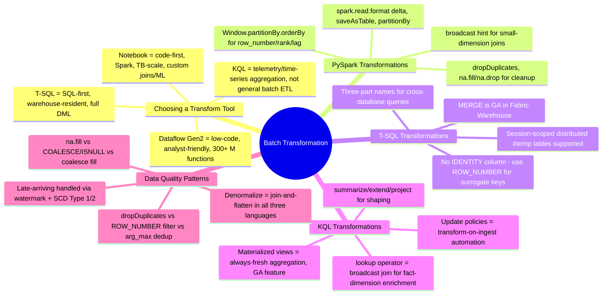
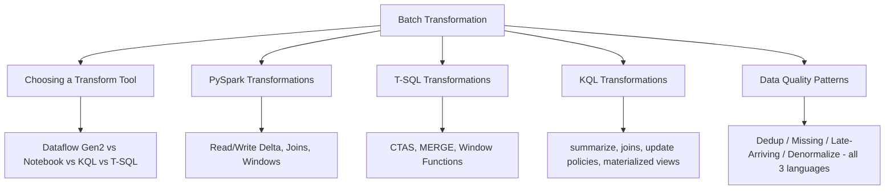

# Batch Transformation (Domain 2 · 30–35%)

Batch transformation is the tri-language heart of Domain 2 — the exam blueprint explicitly requires you to "transform data by using PySpark, SQL, and KQL," and to apply the same handful of data-quality patterns (denormalize, group and aggregate, handle duplicate/missing/late-arriving data) across all three. This section starts with the tool-choice decision (Dataflows Gen2 vs. notebooks vs. KQL vs. T-SQL), then dedicates one file to each language's transformation surface, and closes with a cross-language file that shows every core data-quality pattern implemented three times — once per language — back to back. The exam consistently rewards recognizing that the *pattern* (dedup, fill missing, handle late arrivals) is language-agnostic, but the *syntax* to express it changes completely.

---

## Quick Recall

---

## Topics Overview

## Section Contents

| File | Topic | Priority |
| :--- | :--- | :--- |
| [01-choosing-transform-tool.md](01-choosing-transform-tool.md) | The transform-tool decision matrix — Dataflows Gen2 vs. notebooks vs. KQL vs. T-SQL by skill profile, data volume, source/sink targets, transform expressiveness, cost model, and orchestration fit; distractor patterns | High |
| [02-pyspark-transformations.md](02-pyspark-transformations.md) | Reading/writing Delta tables, `select`/`filter`/`withColumn`, joins and the broadcast hint, `groupBy`/`agg`, window functions, `dropDuplicates`, null handling, casting, `when`/`otherwise` | High |
| [03-tsql-transformations.md](03-tsql-transformations.md) | CTAS, `INSERT..SELECT`, `MERGE` (GA in Fabric Warehouse), `GROUP BY`/`HAVING`, window functions, cross-database three-part names, `#temp` tables vs. CTEs, Fabric Warehouse data-type differences, `COPY INTO` | High |
| [04-kql-transformations.md](04-kql-transformations.md) | `summarize`/`extend`/`project`, join kinds including `lookup`, `mv-expand`, `parse`/`extract`, `bin()`, materialized views, update policies (transform-on-ingest), `let` statements, T-SQL→KQL translation table | High |
| [05-data-quality-patterns.md](05-data-quality-patterns.md) | Denormalization, grouping/aggregation, deduplication, missing-data handling, and late-arriving data — every pattern shown in PySpark, T-SQL, and KQL side by side | High |

## Key Concepts

- **The tool-choice bullet is about transformation, not ingestion** — Dataflow Gen2, notebooks, KQL, and T-SQL are the four transform surfaces; the deciding factors are skill profile, data volume, and DML/expressiveness needs, not which connector count is highest
- **`MERGE` is a generally available T-SQL feature in Fabric Warehouse** as of this writing — a change from earlier Fabric Warehouse limitations the exam may still probe as a "gotcha"
- **Every data-quality pattern has a native idiom per language** — `dropDuplicates()`/`ROW_NUMBER() = 1`/`arg_max()` all solve deduplication, but reaching for the wrong one in the wrong engine is a common exam trap
- **KQL's `lookup` operator and update policies are transformation tools in their own right** — `lookup` is a broadcast-optimized join for fact/dimension enrichment, and update policies implement transform-on-ingest without any external orchestration

## Related Resources

- [06-Batch Ingestion](../06-batch-ingestion/batch-ingestion.md)
- [08-Streaming Data](../08-streaming-data/streaming-data.md)
- [Official: Fabric decision guide — copy activity, dataflow, Eventstream, or Spark](https://learn.microsoft.com/en-us/fabric/fundamentals/decision-guide-pipeline-dataflow-spark)
- [Official: T-SQL surface area in Fabric Data Warehouse](https://learn.microsoft.com/en-us/fabric/data-warehouse/tsql-surface-area)
- [Official: Kusto Query Language overview](https://learn.microsoft.com/en-us/kusto/query/?view=microsoft-fabric)
- [Official: DP-700 skills measured](https://learn.microsoft.com/en-us/credentials/certifications/resources/study-guides/dp-700)

---

**[← Previous](../06-batch-ingestion/batch-ingestion.md) | [↑ Back to Certification](../dp-700-overview.md) | [Next →](../08-streaming-data/streaming-data.md)**
