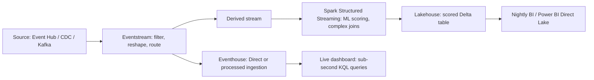

# Choosing a Streaming Engine

## Overview

Microsoft Fabric offers three distinct surfaces for working with streaming data — Eventstream, Spark Structured Streaming, and KQL/Eventhouse — and the exam blueprint's "implement a streaming engine" bullet is really asking whether you can match a scenario's source type, transform complexity, latency requirement, and team skillset to the right one. All three *can* ingest a Kafka-compatible or Event Hubs stream; what separates them is whether the transform logic is no-code or code-first, whether the destination needs sub-second query latency or Spark-scale batch analytics, and how much custom windowing/joining logic the scenario demands.

> [!abstract]
>
> - **Eventstream** = no-code ingestion, transformation, and routing hub — the default choice for connecting sources to destinations without writing code
> - **Spark Structured Streaming** = code-first, notebook/Spark-job-based streaming — the choice when transform logic is too complex for no-code operators (custom joins, ML scoring, arbitrary Python/Scala)
> - **KQL/Eventhouse** = the native real-time query engine — the choice whenever the destination itself needs sub-second query latency over high-cardinality time-series data
> - These three surfaces **compose**, they don't compete — a typical production pipeline uses Eventstream to land and lightly transform data, then hands off to Spark or KQL for anything heavier

> [!tip] What the Exam Tests
>
> - Matching a scenario's source type, transform complexity, and skillset to the correct primary streaming engine
> - Recognizing when Eventstream's no-code operators are sufficient vs. when a scenario needs Spark's code-first expressiveness
> - Knowing that Eventstream is not a query engine — it lands and transforms data in flight, then routes it to a destination where it's queried
> - Distinguishing "which engine ingests the data" from "which engine is queried by the end user" — a single pipeline can use different engines for each

---

## The Decision Matrix

| Factor | Eventstream | Spark Structured Streaming | KQL / Eventhouse |
| :--- | :--- | :--- | :--- |
| **Primary role** | No-code ingestion, in-flight transformation, and routing hub | Code-first stream processing inside a notebook or Spark job definition | Native real-time query engine; also a streaming *destination* |
| **Source types** | 30+ built-in connectors: Azure Event Hubs, IoT Hub, Event Grid, Service Bus, 9 database CDC connectors, Kafka-compatible clients, Google Pub/Sub, Amazon Kinesis, sample data, and more | Anything with a Spark connector — commonly `eventhubs` (Event Hubs/Kafka protocol), files, or a table already landed by Eventstream | Direct ingestion from Eventstream, or native ingestion clients (streaming/queued) — not a general-purpose source connector hub itself |
| **Transform complexity** | 7 no-code operators (filter, manage fields, aggregate, group by/window, union, expand, join) plus a preview SQL operator; ==no arbitrary code== | ==Unbounded== — full PySpark/Scala/SQL, custom joins, UDFs, ML model scoring, arbitrary business logic | KQL query language: `summarize`, `extend`, `parse`, `lookup`, update policies, materialized views — powerful but scoped to KQL's operator set |
| **Latency to destination** | Milliseconds to seconds in transit; the *query* latency depends on where it lands | Micro-batch by default (seconds), tunable with `trigger()`; not built for sub-second interactive queries | ==Sub-second to seconds== query latency once ingested — purpose-built for "what's happening right now" |
| **Skill profile** | No-code / low-code — drag-and-drop canvas, minimal training needed | Spark/Python/Scala engineers | KQL analysts, time-series/telemetry specialists |
| **Destinations** | Lakehouse, Eventhouse, Fabric Activator, derived stream, custom endpoint, Spark notebook (preview) | Delta tables (lakehouse), any sink `writeStream` supports | Native Eventhouse tables (its own store); can also expose data to OneLake via OneLake availability |
| **Windowing support** | Group by operator: tumbling, hopping, sliding, session windows — no-code, UI-configured | `window()` and `session_window()` functions in a `groupBy` — full programmatic control, combinable with watermarks | `bin()` inside `summarize` for tumbling-style buckets; `row_window_session()` for session windows — query-time, not a standing pipeline stage |
| **Scale model** | Managed, auto-scaling within Fabric capacity; throughput governed by capacity SKU | Spark pool sizing — you choose node size/count, autoscale within configured bounds | Eventhouse compute scales with the KQL database's assigned capacity |
| **Delivery guarantee** | At-least-once end to end; effectively-once needs a downstream dedup step | Exactly-once **at the checkpoint-to-Delta-sink relationship**, given a supported idempotent sink; upstream redelivery still needs handling | At-least-once at ingestion; effectively-once via a materialized view (`arg_max`) or query-time dedup |

> [!note] Mental model
> Think of the three engines as **stations on a factory line**, not three separate factories. Eventstream is the **conveyor belt with basic sorting arms** — it moves everything and can filter, relabel, or split boxes as they pass, but it can't perform surgery on the contents. Spark Structured Streaming is the **workbench with a full toolkit** — you pull a box off the belt (or feed it from a source directly) and do arbitrarily complex work on it. KQL/Eventhouse is the **display case with instant lookup** — once something is in the case, a customer (a query) can find it in milliseconds, which is exactly what the case is built for. A production pipeline usually uses the belt to route, the workbench for the hard transformations, and the display case as the final, queryable home.

**Practice Question 1** *(Medium)*

A retail company wants to ingest point-of-sale events from an Event Hub, apply simple filtering (drop test-store transactions) and field renaming, and route the cleaned events to both a lakehouse for nightly BI and an Eventhouse for a live "sales right now" dashboard — with no custom code and minimal engineering effort. Which engine should be the primary pipeline?

A. Spark Structured Streaming, because it can write to both a lakehouse and an Eventhouse  
B. Eventstream, because Filter and Manage fields are no-code operators and a single eventstream can fan out to a Lakehouse destination and an Eventhouse destination simultaneously  
C. KQL, because Eventhouse is the only destination that matters for a "live" dashboard  
D. A custom application connecting to both destinations directly, bypassing Fabric ingestion entirely  

> [!success]- Answer
> **B. Eventstream, because Filter and Manage fields are no-code operators and a single eventstream can fan out to a Lakehouse destination and an Eventhouse destination simultaneously**
>
> The transform requirements (filtering, field renaming) map directly onto Eventstream's Filter and Manage fields operators, and Eventstream natively supports attaching multiple destinations — Lakehouse and Eventhouse — to the same stream without interfering with each other. Spark would work but adds unnecessary code and operational overhead for a transform this simple. KQL alone can't ingest from Event Hubs and simultaneously feed a lakehouse without something upstream doing the routing.

## Worked Scenario: When Eventstream Isn't Enough

A logistics company ingests GPS pings from 50,000 vehicles and needs to:

- Join each ping against a slowly-changing "vehicle assignment" reference table to attach driver and route metadata
- Run a custom anomaly-detection model (a Python function using a pretrained scikit-learn model) against each enriched event
- Write the scored results to a Delta table with exactly-once semantics at the sink

**Resolution:** Spark Structured Streaming. Eventstream's Join operator can combine two streams, but scoring events against a custom Python ML model is outside the no-code operator set entirely — this requires a `foreachBatch` or a UDF inside a Spark job, with `readStream` from the GPS source (directly, or via an Eventstream custom-endpoint hop) and `writeStream` to Delta with `checkpointLocation` set for the exactly-once-at-the-sink guarantee. Eventstream could still be the ingestion front door (landing the raw GPS pings and doing lightweight filtering before Spark picks them up), but the core transform-and-score logic belongs in Spark.

## Worked Scenario: When KQL/Eventhouse Is the Only Right Answer

A security operations team ingests firewall and authentication logs at 200,000 events/second and needs analysts to run ad hoc KQL queries with sub-second response times over the last 7 days of data to investigate active incidents.

**Resolution:** KQL/Eventhouse. The defining signals — very high ingestion volume, sub-second interactive query latency, a KQL-skilled analyst team, and a "search the recent past instantly" access pattern — are exactly what Eventhouse is purpose-built for. Landing this volume in a lakehouse would work for later batch analysis but couldn't deliver sub-second ad hoc query latency; Spark Structured Streaming is a transform engine, not an interactive query destination at all. Eventstream would typically still front the pipeline (routing the raw logs to Eventhouse with **Direct ingestion** or **Event processing before ingestion**), but the query destination — the actual answer to "which engine" for this scenario — is Eventhouse.

## Composing All Three: A Reference Pipeline

Most production streaming solutions on Fabric don't pick a single engine — they chain two or three together, with each engine doing the part it's best at:

Reading this left to right: Eventstream is almost always the front door (widest connector catalog, least effort), a derived stream branches off anything that needs Spark's code-first power, and Eventhouse receives whatever needs sub-second query latency. None of the three engines needs to "win" the whole pipeline — the exam scenario usually describes one stage's requirement at a time, and the correct answer is the engine that fits *that* stage.

## Cost and Operational Considerations

| Factor | Eventstream | Spark Structured Streaming | KQL / Eventhouse |
| :--- | :--- | :--- | :--- |
| **Billing model** | Fabric capacity consumption based on data processed/routed | Spark pool compute time (node-hours) | Eventhouse compute + storage (including any query-acceleration cache) |
| **Operational overhead** | Lowest — managed, no cluster/session to size or monitor | Highest — pool sizing, job retries, checkpoint management, monitoring hub | Moderate — ingestion method choice (streaming vs. queued) and retention/caching policy tuning |
| **Failure recovery** | Managed by the platform; pause/resume controls on derived streams | Manual: retry policies on Spark job definitions, checkpoint-driven restart | Managed ingestion pipeline; update policies/materialized views recompute automatically as new data lands |

> [!warning] Common Mistake
> Picking an engine purely on "which one is cheapest" without weighing operational overhead. Eventstream's lower operational burden often outweighs a marginal compute-cost difference for simple transforms, while a scenario demanding complex custom logic will cost *more* in engineering time to force into Eventstream's no-code operators than it would to just run it in Spark from the start.

**Practice Question 2** *(Hard)*

A team streams IoT sensor telemetry and needs to compute a 5-minute tumbling-window average per device, with the result queryable by a Power BI report refreshing every 10 seconds. The team has no Spark or Python experience but is comfortable with drag-and-drop tools and basic KQL. Which combination of engines fits, and why would Spark Structured Streaming alone be a weaker fit for the query side?

A. Spark Structured Streaming alone — `window()` can compute the aggregate and Power BI can query the resulting Delta table directly with sub-10-second freshness  
B. Eventstream (Group by operator, tumbling window) routing into Eventhouse, queried by Power BI — matches the team's skillset and Eventhouse's sub-second query latency beats a Delta table's typical query/refresh characteristics for a 10-second dashboard cadence  
C. KQL alone, with no Eventstream front end, since Eventhouse can ingest anything directly  
D. Spark Structured Streaming with `outputMode("complete")` writing to a lakehouse, refreshed by Power BI Direct Lake  

> [!success]- Answer
> **B. Eventstream (Group by operator, tumbling window) routing into Eventhouse, queried by Power BI — matches the team's skillset and Eventhouse's sub-second query latency beats a Delta table's typical query/refresh characteristics for a 10-second dashboard cadence**
>
> The team's skillset (no Spark/Python, comfortable with no-code + basic KQL) rules out Spark as the primary engine, and Eventstream's Group by operator directly supports tumbling windows with no code. Eventhouse is the better query destination for a 10-second dashboard refresh cadence — its query engine targets sub-second latency, while a lakehouse's Spark-based query path and file-compaction characteristics are tuned for batch/interactive analytics, not rapid-fire dashboard polling. Option A's Spark answer would technically function but ignores the team's skillset and is a weaker query-latency fit; option C ignores that most CDC/IoT-style sources still typically front through Eventstream even when Eventhouse is the destination; option D compounds both issues.

**Practice Question 3** *(Medium)*

A startup with a two-person data team needs to stand up a streaming pipeline quickly: ingest clickstream events, drop bot traffic (a simple field-based filter), and land the result in a lakehouse for weekly reporting. There's no requirement for sub-second query latency or custom transformation logic. Which engine minimizes both engineering effort and operational overhead?

A. Spark Structured Streaming, since it's the most flexible for future growth  
B. KQL/Eventhouse, since it's the fastest query engine  
C. Eventstream alone — Filter operator drops bot traffic, Lakehouse destination lands the result, no code or cluster management required  
D. All three engines in parallel, to future-proof the architecture  

> [!success]- Answer
> **C. Eventstream alone — Filter operator drops bot traffic, Lakehouse destination lands the result, no code or cluster management required**
>
> Every signal in the scenario — small team, simple filter-only transform, no sub-second query requirement, weekly (not real-time) reporting — points to the lowest-overhead option. Spark and KQL both add operational surface area (pool sizing, cluster management, or a dedicated Eventhouse) that this scenario's requirements don't justify. Building for "future growth" or "future-proofing" that isn't a stated requirement is a common overengineering trap the exam expects you to recognize and avoid.

## Distractor Patterns to Recognize

| Scenario phrase | Trap | Correct read |
| :--- | :--- | :--- |
| "The team needs a custom ML model scored against every streaming event" | Reaching for Eventstream because "it's the streaming tool" | Spark Structured Streaming — arbitrary code (a scikit-learn/PyTorch model call) is outside Eventstream's no-code operator set |
| "Analysts need sub-second query latency over the last hour of telemetry" | Picking a lakehouse because "everything ends up in Delta anyway" | Eventhouse — sub-second interactive query latency is its defining trait, not a lakehouse's |
| "No engineering team, just drag-and-drop this pipeline together" | Defaulting to Spark because it's "more powerful" | Eventstream — no-code is a requirement here, and Eventstream's 7 operators cover common transforms |
| "We need this data queryable by both Spark notebooks and KQL analysts" | Assuming only one engine can be "the" destination | Multiple destinations from one eventstream (Lakehouse + Eventhouse) is a first-class, supported pattern |
| "Eventstream can ingest Kafka, so we don't need Spark at all" | Treating engine choice as all-or-nothing | Engines compose — Eventstream commonly fronts a pipeline that later hands off to Spark or KQL for heavier work |

## Use Cases

- A no-code team building a pipeline from an Event Hub through simple filtering/field-renaming into both a lakehouse and an Eventhouse — Eventstream end to end
- A data engineering team enriching a stream with a custom Python anomaly-detection model before writing exactly-once to Delta — Spark Structured Streaming
- A SOC team running ad hoc KQL investigations over a firehose of security logs with sub-second response times — KQL/Eventhouse
- A hybrid pipeline: Eventstream lands and lightly filters IoT data, a derived stream feeds a Spark notebook for ML scoring, and the scored output lands in an Eventhouse for a live dashboard

## Common Issues & Errors

| Issue | Cause | Resolution |
| :--- | :--- | :--- |
| A team builds a complex custom join/enrichment pipeline entirely in Eventstream and hits a wall | Eventstream's no-code operators don't support arbitrary code or complex multi-step business logic | Move the complex transform into a Spark Structured Streaming job, optionally fed by an Eventstream derived stream |
| A Power BI dashboard querying a lakehouse Delta table can't hit a sub-second refresh SLA | Lakehouse/Spark query paths aren't tuned for sub-second interactive latency | Route the data to an Eventhouse destination instead, and query it there |
| A team assumes Eventhouse can replace Eventstream as the ingestion front door for every source type | Eventhouse's native ingestion clients don't cover the 30+ connector catalog Eventstream offers | Use Eventstream to front the ingestion, with Eventhouse (Direct ingestion or Event processing before ingestion) as a destination |
| Engineers debate "Spark vs. KQL" as if only one can be chosen for the whole solution | Treating streaming engine choice as mutually exclusive rather than compositional | Recognize that Fabric pipelines commonly use two or three of these engines together, each for what it does best |
| A Spark Structured Streaming job is chosen purely because "it's the most powerful engine," then sits idle most of the day for a low-volume, simple-filter workload | Over-provisioning engineering complexity relative to the actual transform requirement | Re-evaluate against Eventstream's no-code operators first — reserve Spark for genuine code-level requirements |
| A team builds three separate eventstreams, one per destination, from the same source | Not recognizing that one eventstream can fan out to multiple destinations (including via derived streams for content-based routing) | Consolidate into a single eventstream with multiple destination branches, reducing ingestion cost and operational surface area |

## Best Practices

- Default to Eventstream as the ingestion and light-transform front door — it covers the widest source catalog and requires the least engineering effort
- Reach for Spark Structured Streaming specifically when a transform needs code: custom joins beyond Eventstream's Join operator, UDFs, or ML scoring
- Reach for Eventhouse specifically when the *query* side of the pipeline needs sub-second latency over high-cardinality time-series data
- Design pipelines as a chain of engines rather than forcing one engine to do everything — Eventstream → Spark → Eventhouse is a common, fully supported topology
- Weigh operational overhead alongside raw compute cost — the "cheapest" engine on paper can cost more once engineering time to force-fit a transform is accounted for
- Revisit the engine choice if a pipeline's requirements grow — a workload that starts as simple Eventstream filtering can outgrow no-code operators as business logic accretes

## Exam Tips

> [!tip] Exam Tips
>
> - "No-code," "drag-and-drop," or "minimal engineering effort" → Eventstream
> - "Custom code," "ML model," "complex multi-source join logic" → Spark Structured Streaming
> - "Sub-second query latency," "KQL," "telemetry/time-series investigation" → KQL/Eventhouse
> - These three engines are not mutually exclusive — a scenario describing a multi-stage pipeline may have more than one "correct" engine, one per stage
> - Eventstream is a transform-and-route hub, not a query engine — the *query* destination is always a separate item (lakehouse, Eventhouse, custom endpoint)

## Key Takeaways

- Eventstream, Spark Structured Streaming, and KQL/Eventhouse solve different parts of a streaming pipeline: no-code transform-and-route, code-first complex transform, and sub-second query destination, respectively
- The deciding factors are source-connector breadth, transform complexity, query-latency requirement, and team skillset — not raw ingestion capability, which all three surfaces share to varying degrees
- Production pipelines routinely compose two or three of these engines rather than picking exactly one
- Windowing (tumbling/hopping/sliding/session) is available in all three surfaces with different syntax — covered in full in [05-Windowing Functions](./05-windowing-functions.md)

## Related Topics

- [02-Eventstreams](./02-eventstreams.md)
- [03-Spark Structured Streaming](./03-spark-structured-streaming.md)
- [04-KQL Real-Time](./04-kql-realtime.md)
- [06-Batch Ingestion: Choosing a Data Store](../06-batch-ingestion/01-choosing-data-store.md)

## Official Documentation

- [Microsoft Fabric Eventstreams overview](https://learn.microsoft.com/en-us/fabric/real-time-intelligence/event-streams/overview)
- [Eventhouse overview](https://learn.microsoft.com/en-us/fabric/real-time-intelligence/eventhouse)
- [Data streaming into a lakehouse with Spark](https://learn.microsoft.com/en-us/fabric/data-engineering/lakehouse-streaming-data)
- [Fabric decision guide — copy activity, dataflow, Eventstream, or Spark](https://learn.microsoft.com/en-us/fabric/fundamentals/decision-guide-pipeline-dataflow-spark)
- [Study Guide for Exam DP-700 (skills measured, July 21, 2026)](https://learn.microsoft.com/en-us/credentials/certifications/resources/study-guides/dp-700)

---

**[← Previous](../07-batch-transformation/05-data-quality-patterns.md) | [↑ Back to Section](./streaming-data.md) | [Next →](./02-eventstreams.md)**
