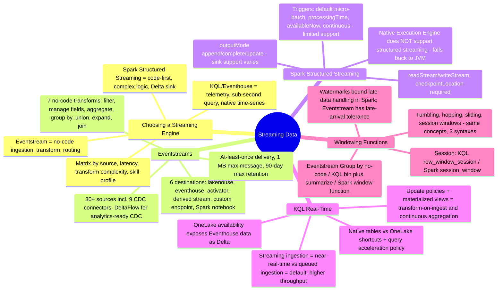
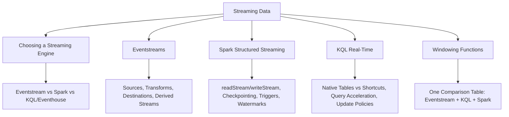

# Streaming Data (Domain 2 · 30–35%)

Streaming data closes out Domain 2 with the exam blueprint's "implement streaming" family: choosing the right streaming engine, building event pipelines in Eventstream, streaming into a lakehouse with Spark Structured Streaming, landing and transforming events in real time with KQL/Eventhouse, and — the one topic that spans all three surfaces — windowing functions. This section leans hard into the guide's decision-matrix and side-by-side-language differentiators: every "choose the streaming engine/table type" bullet gets a matrix and a mental model, and windowing gets a single comparison table spanning Eventstream's no-code Group by, KQL's `bin()`/`summarize`/`row_window_session()`, and Spark's `window()`/`session_window()`.

---

## Quick Recall

---

## Topics Overview

## Section Contents

| File | Topic | Priority |
| :--- | :--- | :--- |
| [01-choosing-streaming-engine.md](01-choosing-streaming-engine.md) | The streaming-engine decision matrix — Eventstream vs. Spark Structured Streaming vs. KQL/Eventhouse by source type, transform complexity, latency, skill profile, destinations, windowing support, and scale model; distractor patterns | High |
| [02-eventstreams.md](02-eventstreams.md) | Eventstream sources (incl. CDC + DeltaFlow), the 7 event-processor transformations, 6 destinations and their delivery guarantees, derived streams, content-based routing, throughput/retention limits, Real-Time hub relationship | High |
| [03-spark-structured-streaming.md](03-spark-structured-streaming.md) | `readStream`/`writeStream` with Delta and Kafka/Event Hubs sources, output modes, triggers, checkpointing, watermarks and late data, `foreachBatch` upserts, streaming into lakehouse tables, Native Execution Engine limitation | High |
| [04-kql-realtime.md](04-kql-realtime.md) | Eventhouse ingestion (streaming vs. queued), native tables vs. OneLake shortcuts, query acceleration policy for shortcuts, update policies + materialized views for streaming transform, OneLake availability of Eventhouse data | High |
| [05-windowing-functions.md](05-windowing-functions.md) | Tumbling/hopping/sliding/session/snapshot windows conceptually, one comparison table across Eventstream/KQL/Spark, a worked 5-minute tumbling aggregate in all three syntaxes, choosing a window type per scenario, watermarks and late data | High |

## Key Concepts

- **The engine-choice bullet is about the whole pipeline, not just ingestion** — Eventstream, Spark Structured Streaming, and KQL/Eventhouse overlap in what they can ingest, but differ sharply in transform expressiveness, code requirement, and query latency at the destination
- **Eventstream's 7 no-code transforms cover most exam scenarios** — filter, manage fields, aggregate, group by (windowed), union, expand, join — with a SQL operator (preview) for anything that needs code-level control
- **The Native Execution Engine does not accelerate Structured Streaming** — a query that streams into a lakehouse always runs on the standard JVM Spark engine, regardless of whether NEE is enabled for the workspace
- **Query acceleration on a OneLake shortcut behaves like an external table** — no materialized views, no update policies; native Eventhouse tables are required for those transform-on-ingest mechanisms
- **Windowing is one concept with three syntaxes** — the exam rewards recognizing that a "5-minute tumbling aggregate" requirement maps to Eventstream's Group by operator, KQL's `summarize ... by bin(Timestamp, 5m)`, or Spark's `window("timestamp", "5 minutes")` depending on which engine the scenario names

## Related Resources

- [05-Loading Patterns](../05-loading-patterns/loading-patterns.md)
- [07-Batch Transformation](../07-batch-transformation/batch-transformation.md)
- [09-Monitoring & Alerting](../09-monitoring-alerting/monitoring-alerting.md)
- [Official: Microsoft Fabric Eventstreams overview](https://learn.microsoft.com/en-us/fabric/real-time-intelligence/event-streams/overview)
- [Official: Data streaming into a lakehouse with Spark](https://learn.microsoft.com/en-us/fabric/data-engineering/lakehouse-streaming-data)
- [Official: Eventhouse overview](https://learn.microsoft.com/en-us/fabric/real-time-intelligence/eventhouse)
- [Official: DP-700 skills measured](https://learn.microsoft.com/en-us/credentials/certifications/resources/study-guides/dp-700)

---

**[← Previous](../07-batch-transformation/batch-transformation.md) | [↑ Back to Certification](../dp-700-overview.md) | [Next →](../09-monitoring-alerting/monitoring-alerting.md)**
