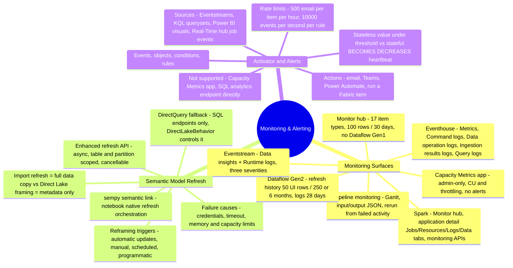
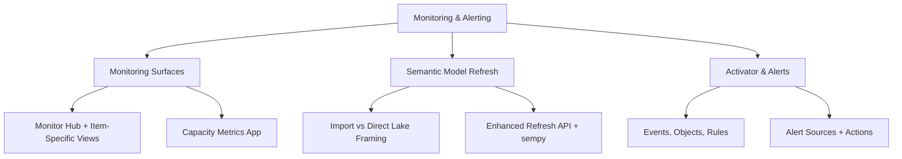

# Monitoring & Alerting (Domain 3 · 30–35%)

Monitoring & Alerting opens Domain 3 with the exam blueprint's "monitor and optimize" family, covering two blueprint bullets in full: **monitor data ingestion and transformation**, and **configure alerts**. This section maps every Fabric monitoring surface — the tenant-wide Monitor hub, pipeline/Dataflow Gen2/Spark/Eventstream/Eventhouse/Copy job item-specific views, and the admin-only Capacity Metrics app — to the symptom it's built to diagnose, then covers semantic model refresh (Import vs. Direct Lake framing, DirectQuery fallback, the enhanced refresh API) as its own deep-dive, and closes with Fabric Activator's event-detection model for turning any of those signals into an automated alert or action.

---

## Quick Recall

---

## Topics Overview

## Section Contents

| File | Topic | Priority |
| :--- | :--- | :--- |
| [01-monitoring-surfaces.md](01-monitoring-surfaces.md) | Monitor hub (item types, filters, historical runs), pipeline run/activity monitoring (output JSON, rerun from failed activity), Dataflow Gen2 refresh history, Spark monitoring (Monitor hub, application detail tabs, monitoring APIs), Eventstream/Eventhouse/Copy job monitoring, Capacity Metrics app, decision guidance by symptom | High |
| [02-semantic-model-refresh.md](02-semantic-model-refresh.md) | Import refresh vs. Direct Lake framing/reframing, DirectQuery fallback, refresh history and failure diagnosis, enhanced refresh API, scheduled refresh configuration, common failure causes, `sempy` for programmatic checks | High |
| [03-activator-alerts.md](03-activator-alerts.md) | Fabric Activator concepts (events, objects, conditions, rules), alert sources, actions, setting alerts from Monitor hub/RTI surfaces, alert-on-pipeline-failure pattern, documented limits and licensing notes | High |

## Key Concepts

- **Monitoring is layered, not single-pane** — Monitor hub gives cross-item status at a glance, but item-specific surfaces (Dataflow Gen2 refresh history, Spark application detail, Eventstream Data insights) hold the deeper diagnostic detail, and workspace monitoring's KQL-queryable Eventhouse is what breaks past Monitor hub's 30-day retention cap
- **Direct Lake refresh is fundamentally different from Import refresh** — framing updates metadata references in seconds, while Import refresh replicates the entire data volume; the exam rewards knowing framing/reframing vocabulary precisely, plus when Direct Lake on SQL endpoints silently falls back to DirectQuery
- **The Capacity Metrics app is admin-scoped and alert-free** — it's the tool for "is my whole capacity throttling," not "did my job succeed," and it explicitly cannot fire alerts on its own
- **Activator alert authoring is decentralized by design** — Eventstream, KQL querysets, Real-Time dashboards, Power BI visuals, and Real-Time hub all offer in-context "Set Alert," all backed by the same underlying Activator item and rule model
- **Stateful conditions exist to prevent alert spam** — `BECOMES`/`DECREASES`/`EXIT RANGE` fire only on a state transition, unlike a raw stateless threshold comparison that fires on every qualifying event

## Related Resources

- [08-Streaming Data](../08-streaming-data/streaming-data.md)
- [10-Error Resolution](../10-error-resolution/error-resolution.md)
- [11-Performance Optimization](../11-performance-optimization/performance-optimization.md)
- [Official: Monitoring hub](https://learn.microsoft.com/en-us/fabric/admin/monitoring-hub)
- [Official: Direct Lake overview](https://learn.microsoft.com/en-us/fabric/fundamentals/direct-lake-overview)
- [Official: What is Fabric Activator?](https://learn.microsoft.com/en-us/fabric/real-time-intelligence/data-activator/activator-introduction)
- [Official: DP-700 skills measured](https://learn.microsoft.com/en-us/credentials/certifications/resources/study-guides/dp-700)

---

**[← Previous](../08-streaming-data/streaming-data.md) | [↑ Back to Certification](../dp-700-overview.md) | [Next →](../10-error-resolution/error-resolution.md)**
