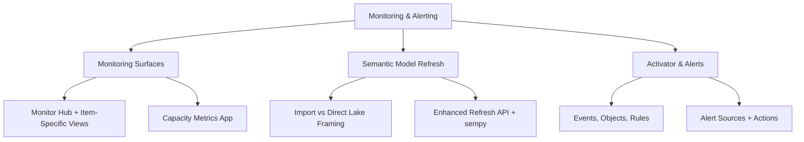

# Monitoring & Alerting (Domain 3 · 30–35%)

Monitoring & Alerting opens Domain 3 with the exam blueprint's "monitor and optimize" family, covering two blueprint bullets in full: **monitor data ingestion and transformation**, and **configure alerts**. This section maps every Fabric monitoring surface — the tenant-wide Monitor hub, pipeline/Dataflow Gen2/Spark/Eventstream/Eventhouse/Copy job item-specific views, and the admin-only Capacity Metrics app — to the symptom it's built to diagnose, then covers semantic model refresh (Import vs. Direct Lake framing, DirectQuery fallback, the enhanced refresh API) as its own deep-dive, and closes with Fabric Activator's event-detection model for turning any of those signals into an automated alert or action.

---

## Quick Recall

```mermaid
mindmap
  root((Monitoring & Alerting))
    Monitoring Surfaces
      Monitor hub - 17 item types, 100 rows / 30 days, no Dataflow Gen1
      Pipeline monitoring - Gantt, input/output JSON, rerun from failed activity
      Dataflow Gen2 - refresh history 50 UI rows / 250 or 6 months, logs 28 days
      Spark - Monitor hub, application detail Jobs/Resources/Logs/Data tabs, monitoring APIs
      Eventstream/Eventhouse - Data insights + Runtime logs (3 severities); Metrics, Command/Data operation/Ingestion/Query logs
      Capacity Metrics app - admin-only, CU and throttling, no alerts
    Semantic Model Refresh
      Import refresh = full data copy vs Direct Lake framing = metadata only
      Reframing triggers - automatic updates, manual, scheduled, programmatic
      DirectQuery fallback - SQL endpoints only, DirectLakeBehavior controls it
      Enhanced refresh API - async, table and partition scoped, cancellable
      Failure causes - credentials, timeout, memory and capacity limits
      sempy semantic link - notebook native refresh orchestration
    Activator and Alerts
      Events, objects, conditions, rules
      Stateless value under threshold vs stateful BECOMES DECREASES heartbeat
      Sources - Eventstreams, KQL querysets, Power BI visuals, Real-Time hub job events
      Actions - email, Teams, Power Automate, run a Fabric item
      Not supported - Capacity Metrics app, SQL analytics endpoint directly
      Rate limits - 500 email per item per hour, 10000 events per second per rule
```

---

## Topics Overview



## Section Contents

| File | Topic | Priority |
| :--- | :--- | :--- |
| [01-monitoring-surfaces.md](01-monitoring-surfaces.md) | Monitor hub (item types, filters, historical runs), pipeline run/activity monitoring (output JSON, rerun from failed activity), Dataflow Gen2 refresh history, Spark monitoring (Monitor hub, application detail tabs, monitoring APIs), Eventstream/Eventhouse/Copy job monitoring, Capacity Metrics app, decision guidance by symptom | High |
| [02-semantic-model-refresh.md](02-semantic-model-refresh.md) | Import refresh vs. Direct Lake framing/reframing, DirectQuery fallback, refresh history and failure diagnosis, enhanced refresh API, scheduled refresh configuration, common failure causes, `sempy` for programmatic checks | High |
| [03-activator-alerts.md](03-activator-alerts.md) | Fabric Activator concepts (events, objects, conditions, rules), alert sources, actions, setting alerts from Monitor hub/RTI surfaces, alert-on-pipeline-failure pattern, documented limits and licensing notes | High |

## The Domain 3 Triage Spine: Symptom → Surface → Diagnosis → Lever

Every Domain 3 scenario collapses to the same four-step flow: notice a symptom, open the right **monitoring surface** to confirm it, land on a **diagnosis** in [10-Error Resolution](../10-error-resolution/error-resolution.md), then reach for the matching **lever** in [11-Performance Optimization](../11-performance-optimization/performance-optimization.md) if the item isn't broken, just slow. This table is the fast cross-reference for that flow — it doesn't replace the Decision Guidance tables inside each file, it connects them across sections.

| Symptom | Monitoring surface to open first | Likely diagnosis | Lever if slow-not-broken |
| :--- | :--- | :--- | :--- |
| Direct Lake dashboard suddenly slow after a large append | [Semantic model refresh / framing](./02-semantic-model-refresh.md#what-framing-means-and-when-reframing-happens) | [DirectQuery fallback check](./02-semantic-model-refresh.md#directquery-fallback) — confirm reframing actually ran and the table hasn't fallen back | [V-Order](../11-performance-optimization/01-lakehouse-optimization.md#v-order-write-cost-vs-read-benefit) + [Direct Lake guardrails](../11-performance-optimization/05-pipeline-query-optimization.md#direct-lake-vs-import-vs-directquery-performance-traps) |
| Pipeline Copy activity duration creeping up over weeks, no failures | [Pipeline run/activity monitoring](./01-monitoring-surfaces.md#pipeline-run-and-activity-monitoring) | Degraded, not failed — [query folding loss check](../10-error-resolution/01-pipeline-dataflow-errors.md#query-folding-failures) | [Partition option, parallel copies, staging](../11-performance-optimization/05-pipeline-query-optimization.md#partition-option-on-sources) |
| Spark notebook runs slow, then exits | [Spark application monitoring](./01-monitoring-surfaces.md#spark-application-monitoring) | [Executor OOM (exit code 137)](../10-error-resolution/02-notebook-tsql-errors.md#out-of-memory-driver-vs-executor) | [Executor sizing, AQE skew handling, broadcast joins](../11-performance-optimization/03-spark-optimization.md#adaptive-query-execution-aqe) |
| Eventhouse queries slow only on older data | [Eventhouse ingestion monitoring](./01-monitoring-surfaces.md#eventhouse-ingestion-monitoring) | Not an ingestion failure — [rule out via streaming/queued ingestion behavior](../10-error-resolution/03-realtime-errors.md#streaming-vs-queued-ingestion-error-surfaces) | [Hot cache vs. retention policy](../11-performance-optimization/04-realtime-optimization.md#eventhouse-caching-policy-vs-retention-policy) |
| Everything on the capacity feels slow, no single item fails | [Capacity Metrics app](./01-monitoring-surfaces.md#capacity-metrics-app-the-admin-side-view) | [HTTP 430 queueing, not a code bug](../10-error-resolution/02-notebook-tsql-errors.md#spark-session-and-capacity-errors) | [Capacity scale (larger SKU/Autoscale Billing) + workload spread via high concurrency](../11-performance-optimization/03-spark-optimization.md#high-concurrency-session-reuse) |

> [!note] Mental model — triage always flows monitor → diagnose → optimize
> Every Domain 3 question is secretly asking "where are you in this pipe": still figuring out *what's* happening (monitor), already know it's broken and need the fix (diagnose), or already know it isn't broken and just want it faster or cheaper (optimize). Reaching for a performance lever before confirming the symptom via monitoring, or treating a slow-but-succeeding job as an error to "fix," is the recurring trap this spine exists to short-circuit.

## Key Concepts

- **Monitoring is layered, not single-pane** — Monitor hub gives cross-item status at a glance, but item-specific surfaces (Dataflow Gen2 refresh history, Spark application detail, Eventstream Data insights) hold the deeper diagnostic detail, and workspace monitoring's KQL-queryable Eventhouse is what breaks past Monitor hub's 30-day retention cap
- **Direct Lake refresh is fundamentally different from Import refresh** — framing updates metadata references in seconds, while Import refresh replicates the entire data volume; the exam rewards knowing framing/reframing vocabulary precisely, plus when Direct Lake on SQL endpoints silently falls back to DirectQuery
- **The Capacity Metrics app is admin-scoped and alert-free** — it's the tool for "is my whole capacity throttling," not "did my job succeed," and it explicitly cannot fire alerts on its own
- **Activator alert authoring is decentralized by design** — Eventstream, KQL querysets, Real-Time dashboards, Power BI visuals, and Real-Time hub all offer in-context "Set Alert," all backed by the same underlying Activator item and rule model
- **Stateful conditions exist to prevent alert spam** — `BECOMES`/`DECREASES`/`EXIT RANGE` fire only on a state transition, unlike a raw stateless threshold comparison that fires on every qualifying event

## Related Resources

- [08-Streaming Data](../08-streaming-data/streaming-data.md)
- [10-Error Resolution](../10-error-resolution/error-resolution.md)
- [11-Performance Optimization](../11-performance-optimization/performance-optimization.md)
- [Official: Monitoring hub](https://learn.microsoft.com/en-us/fabric/admin/monitoring-hub)
- [Official: Direct Lake overview](https://learn.microsoft.com/en-us/fabric/fundamentals/direct-lake-overview)
- [Official: What is Fabric Activator?](https://learn.microsoft.com/en-us/fabric/real-time-intelligence/data-activator/activator-introduction)
- [Official: DP-700 skills measured](https://learn.microsoft.com/en-us/credentials/certifications/resources/study-guides/dp-700)

---

**[← Previous](../08-streaming-data/streaming-data.md) | [↑ Back to Certification](../dp-700-overview.md) | [Next →](../10-error-resolution/error-resolution.md)**
