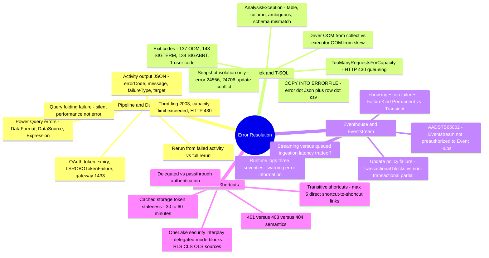
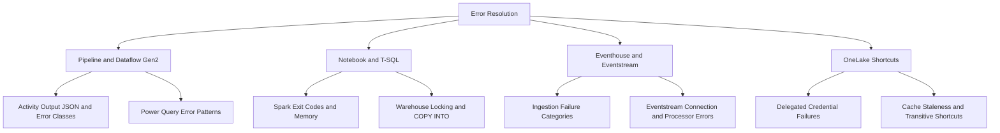

# Error Resolution (Domain 3 · 30–35%)

Error Resolution covers the exam blueprint's **"Identify and resolve errors"** bullet, which names seven distinct error surfaces: pipeline, Dataflow Gen2, notebook, Eventhouse, Eventstream, T-SQL (Warehouse), and OneLake shortcut. This section walks each surface the same way — the symptom you'd see, where to go to diagnose it, and a resolution table mapping cause to fix — building directly on [09-Monitoring & Alerting](../09-monitoring-alerting/monitoring-alerting.md)'s coverage of *where to look*. This section instead answers *what you're looking at once you get there*; it assumes you already know which monitoring surface to open for a given item type, so if a symptom description doesn't immediately map to a surface, revisit [09-Monitoring & Alerting: Monitoring Surfaces](../09-monitoring-alerting/01-monitoring-surfaces.md) first — its Decision Guidance table is the fastest way in.

---

## Quick Recall

---

## Topics Overview

## Section Contents

| File | Topic | Priority |
| :--- | :--- | :--- |
| [01-pipeline-dataflow-errors.md](01-pipeline-dataflow-errors.md) | Pipeline activity failure output JSON, connection/auth/OAuth/gateway errors, staging errors, timeout, throttling and 429/430 capacity errors, parameter/expression errors, rerun from failed activity, retry configuration; Dataflow Gen2 refresh errors, diagnostics download, staging Lakehouse and gateway issues, query folding failures, common Power Query error patterns | High |
| [02-notebook-tsql-errors.md](02-notebook-tsql-errors.md) | Notebook/Spark session and capacity errors, OOM (driver vs. executor), AnalysisException, session startup failures, library/environment errors, Spark UI/log diagnosis; T-SQL Warehouse unsupported syntax, data-type errors, transaction/locking conflicts and snapshot isolation, COPY INTO rejected-row diagnostics, query insights | High |
| [03-realtime-errors.md](03-realtime-errors.md) | Eventhouse ingestion failures (`.show ingestion failures`, permanent vs. transient), streaming vs. queued ingestion error surfaces, update-policy failure behavior; Eventstream source connection errors, throughput/throttling, destination delivery issues, runtime logs and data insights, processor errors | High |
| [04-shortcut-errors.md](04-shortcut-errors.md) | OneLake shortcut auth failures (delegated credential expiry, permission revocation), 401/403/404 semantics, deleted/moved targets, S3/ADLS-specific issues, cache staleness, transitive shortcuts, OneLake security interplay errors, diagnosing across Spark/SQL endpoint/semantic model | High |

## Key Concepts

- **Every surface fails differently, but the diagnostic pattern repeats** — find the exact error code or message first, classify it (permanent vs. transient, user vs. system, auth vs. data), then apply the documented fix rather than guessing from the symptom alone
- **Retry is a valid fix for exactly one class of error** — transient/infrastructure failures (bad node, throttling, transient download errors) resolve on retry; permanent failures (bad format, missing permission, schema mismatch) don't, and retrying them wastes capacity
- **Auth failures cluster around token lifetime, not just wrong credentials** — OAuth token expiry, Conditional Access policy changes, delegated shortcut credential cache staleness (30–60 minutes), and stale device/refresh tokens all present as generic "unauthorized" errors with very different fixes
- **Snapshot isolation is the only isolation level in Fabric Warehouse** — `SET TRANSACTION ISOLATION LEVEL` is silently ignored, and update conflicts (errors 24556/24706) are expected under concurrent writes to the same table, not a bug — the fix is retry logic, not a different isolation level
- **"It failed" and "it's slow" point to different surfaces** — a hard failure has an error code to look up in this section; degraded-but-succeeding behavior (query folding silently disabled, ingestion batching latency) is a performance question covered in [11-Performance Optimization](../11-performance-optimization/performance-optimization.md)

## Related Resources

- [09-Monitoring & Alerting](../09-monitoring-alerting/monitoring-alerting.md)
- [11-Performance Optimization](../11-performance-optimization/performance-optimization.md)
- [Official: Troubleshoot pipelines for Data Factory in Microsoft Fabric](https://learn.microsoft.com/en-us/fabric/data-factory/pipeline-troubleshoot-guide)
- [Official: Troubleshooting guide for Spark jobs in Microsoft Fabric](https://learn.microsoft.com/en-us/fabric/data-engineering/troubleshoot-spark)
- [Official: Troubleshoot the Warehouse](https://learn.microsoft.com/en-us/fabric/data-warehouse/troubleshoot-fabric-data-warehouse)
- [Official: Secure and manage OneLake shortcuts](https://learn.microsoft.com/en-us/fabric/onelake/onelake-shortcut-security)
- [Official: DP-700 skills measured](https://learn.microsoft.com/en-us/credentials/certifications/resources/study-guides/dp-700)

---

**[← Previous](../09-monitoring-alerting/monitoring-alerting.md) | [↑ Back to Certification](../dp-700-overview.md) | [Next →](../11-performance-optimization/performance-optimization.md)**
