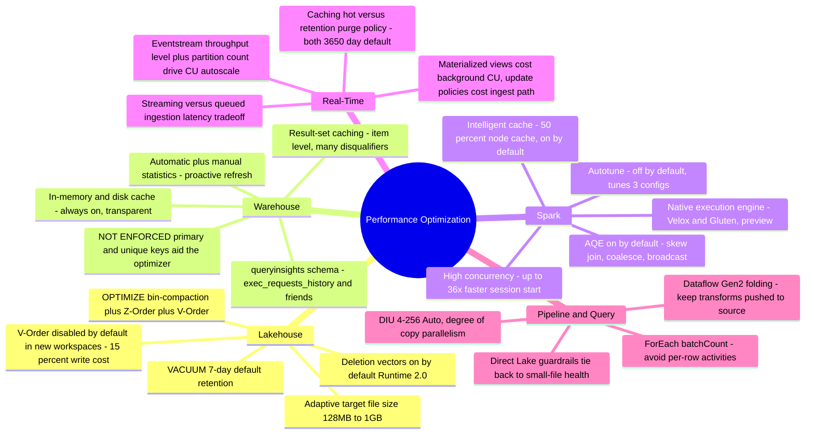
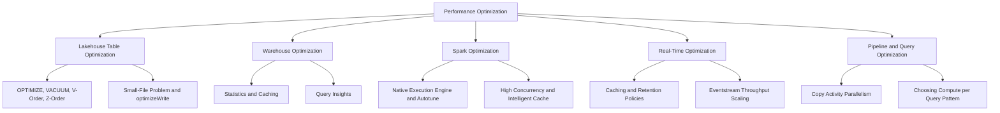

# Performance Optimization (Domain 3 · 30–35%)

Performance Optimization covers the exam blueprint's **"Optimize performance"** bullet, which names six distinct surfaces: lakehouse table, pipeline, data warehouse, Eventstreams and Eventhouses, Spark, and query performance in general. Where [10-Error Resolution](../10-error-resolution/error-resolution.md) asks "what broke and how do I fix it," this section asks "it works, so how do I make it faster or cheaper" — the two sections share diagnostic surfaces (Monitoring hub, query insights, Spark UI) but different questions. This section assumes familiarity with the storage and compute engines it tunes; if a term here is unfamiliar, the relevant Domain 2 topic (loading patterns, batch ingestion, batch transformation, streaming data) explains the underlying mechanism, since this section focuses on the performance lever, not the mechanism itself.

---

## Quick Recall

---

## Topics Overview

## Section Contents

| File | Topic | Priority |
| :--- | :--- | :--- |
| [01-lakehouse-optimization.md](./01-lakehouse-optimization.md) | Delta table maintenance: OPTIMIZE bin-compaction, V-Order write/read tradeoff and current defaults, VACUUM retention, small-file problem and optimizeWrite/adaptive target file size, partitioning vs. Z-Order, table maintenance UI, lakehouse SQL endpoint statistics, deletion vectors | High |
| [02-warehouse-optimization.md](./02-warehouse-optimization.md) | Warehouse engine optimization: automatic and manual statistics, result-set caching, in-memory/disk caching, query insights views, data clustering/distribution, CTAS vs. INSERT patterns, NOT ENFORCED constraints, table design guidance | High |
| [03-spark-optimization.md](./03-spark-optimization.md) | Native execution engine, autotune, starter vs. custom pool latency, executor sizing, AQE, broadcast joins, caching, partition tuning, optimizeWrite configs, high-concurrency session reuse, intelligent cache | High |
| [04-realtime-optimization.md](./04-realtime-optimization.md) | Eventhouse caching vs. retention policy, streaming vs. queued ingestion performance, materialized views vs. update policies cost profile, partitioning policy, query best practices, OneLake availability cost, query acceleration recap; Eventstream throughput units, processor efficiency, destination batching | High |
| [05-pipeline-query-optimization.md](./05-pipeline-query-optimization.md) | Copy activity parallelism and DIUs, staging, partition option, binary vs. parsed copies, ForEach batchCount; Direct Lake vs. Import vs. DirectQuery traps, SQL endpoint tuning, Dataflow Gen2 folding, choosing compute per query pattern | High |

## Key Concepts

- **Every engine trades write cost for read speed somewhere** — V-Order (~15% slower writes, faster reads), result-set caching (background eviction cost, near-instant repeat reads), materialized views (continuous background CU, instant aggregate reads). Optimization is choosing which side of that trade your workload needs.
- **Small files are the root cause behind more symptoms than they get credit for** — slow SQL endpoint queries, Direct Lake guardrail fallback, expensive deletion-vector purges, and degraded Spark parallelism all trace back to file-size health, which is why [01-Lakehouse Optimization](./01-lakehouse-optimization.md) sits first in this section.
- **Most performance features in Fabric default toward safety or write-throughput, not maximum read speed** — V-Order off by default in new workspaces, autotune off by default, result-set caching subject to a long disqualification list. Verify the *current* default before assuming a feature is helping.
- **Statistics and caching are automatic almost everywhere** — Warehouse auto-creates and proactively refreshes statistics, in-memory/disk caching can't be disabled, and Spark's intelligent cache and AQE are on by default. The exam's performance angle is usually "know when a manual override is worth it," not "remember to turn caching on."
- **"It's slow" needs a different playbook per engine** — a Spark job's slowness lever (partition tuning, native execution engine, caching) is a different toolbox than a Warehouse query's (statistics, result-set cache, constraints) or an Eventhouse query's (caching policy, materialized views, partitioning policy). Match the symptom to the right file before reaching for a fix.

## Related Resources

- [09-Monitoring & Alerting](../09-monitoring-alerting/monitoring-alerting.md)
- [09-Monitoring & Alerting: The Domain 3 Triage Spine](../09-monitoring-alerting/monitoring-alerting.md) — symptom-to-lever cross-reference spanning this section (see "The Domain 3 Triage Spine" table near the top of the file)
- [10-Error Resolution](../10-error-resolution/error-resolution.md)
- [Official: Cross-workload table maintenance and optimization](https://learn.microsoft.com/en-us/fabric/fundamentals/table-maintenance-optimization)
- [Official: Optimize Delta Lake tables with V-Order in Fabric](https://learn.microsoft.com/en-us/fabric/data-engineering/delta-optimization-and-v-order)
- [Official: Native execution engine for Fabric Data Engineering](https://learn.microsoft.com/en-us/fabric/data-engineering/native-execution-engine-overview)
- [Official: Query insights](https://learn.microsoft.com/en-us/fabric/data-warehouse/query-insights)
- [Official: DP-700 skills measured](https://learn.microsoft.com/en-us/credentials/certifications/resources/study-guides/dp-700)

---

**[← Previous](../10-error-resolution/error-resolution.md) | [↑ Back to Certification](../dp-700-overview.md) | [Next →](./01-lakehouse-optimization.md)**
