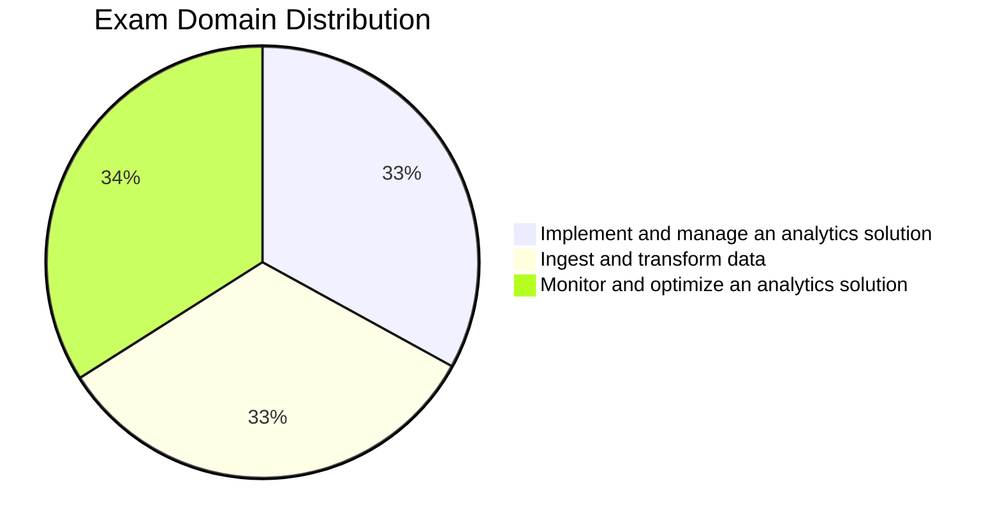

# Microsoft DP-700: Implementing Data Engineering Solutions Using Microsoft Fabric

> [!info] What's New for the July 2026 Exam (updated July 2026)
> Microsoft refreshed the official DP-700 skills measured list on **July 21, 2026**. This guide is aligned to that blueprint. There is exactly **one** change versus the prior **April 20, 2026** blueprint — a minor rewording within *Configure Microsoft Fabric workspace settings* (Domain 1):
>
> - **"Configure Dataflows Gen2 workspace settings"** → **"Configure Apache Airflow workspace settings"**
>
> Every other bullet across all three domains is unchanged. Don't treat any other topic as "new in July" — this is the only diff Microsoft published.

## How to Use This Guide

1. **Topic files** (`01-topic-name.md`) — core study material with PySpark/T-SQL/KQL examples, comparison tables, and practice questions. Start here.
2. **Section indexes** — overview flowcharts and topic indexes named after their folder (e.g., `orchestration.md`). Use to orient before diving into a section.
3. **Cheat sheets** (`resources/cheat-sheets/`) — compact quick-reference for exam day and review. Each ends with a `## Gotchas & Traps` section and a `## Before the Exam, I Can…` checklist. Use after studying a section to reinforce, and drill the companion **Anki deck** (`resources/anki/anki-deck.md`, 146 cards) alongside each cheat sheet for spaced-repetition recall.
4. **Practice questions** (`resources/practice-questions/`) — questions across the three domains, with explanations. Use to test knowledge after each domain.
5. **Mock exams** (`resources/mock-exam/`, `resources/mock-exam-2/`, `resources/mock-exam-3/`) — full 50-question timed exams (45 standalone + 5-question case study mirroring the real DP-700 format). Read **Exam Tips** (`resources/exam-tips.md`) before your first mock for time-budget and case-study strategy. After each mock, use the matching **debrief** file (`mock-exam-N-debrief.md`) to map missed questions back to study material.
6. **Final Review** (`resources/final-review.md`) — 20-minute exam-morning scan: highest-probability facts across all three domains and last-minute traps. Read the morning of the exam.

> Study path: topic files → cheat sheets + Anki deck → practice questions → exam tips → mock exams → **final-review.md** (exam morning)

## Exam Overview

| Detail             | Information                                               |
| ------------------ | ----------------------------------------------------------|
| **Exam**           | DP-700                                                     |
| **Full Name**      | Implementing Data Engineering Solutions Using Microsoft Fabric |
| **Credential**     | Microsoft Certified: Fabric Data Engineer Associate        |
| **Passing Score**  | 700 / 1000                                                 |
| **Duration**       | 100 minutes                                                |
| **Renewal**        | Annual (free online assessment on Microsoft Learn)         |
| **Platforms**      | Microsoft Fabric                                           |
| **Languages**      | PySpark, T-SQL, KQL                                        |

## Exam Domain Weights

## Study Topics

### Domain 1: Implement and Manage an Analytics Solution (30–35%)

| Section | Priority | Topics |
| :--- | :--- | :--- |
| [01-Fabric Workspace Settings](01-fabric-workspace-settings/fabric-workspace-settings.md) | High | Spark, domain, OneLake, and Apache Airflow workspace settings |
| [02-Lifecycle Management](02-lifecycle-management/lifecycle-management.md) | High | Version control, database projects, deployment pipelines |
| [03-Security & Governance](03-security-governance/security-governance.md) | High | Access controls, dynamic data masking, OneLake security, governance |
| [04-Orchestration](04-orchestration/orchestration.md) | High | Choosing an orchestration tool, schedules/triggers, orchestration patterns |

### Domain 2: Ingest and Transform Data (30–35%)

| Section | Priority | Topics |
| :--- | :--- | :--- |
| [05-Loading Patterns](05-loading-patterns/loading-patterns.md) | High | Full/incremental loads, dimensional model loading, streaming loading pattern |
| [06-Batch Ingestion](06-batch-ingestion/batch-ingestion.md) | High | Data store choice, OneLake shortcuts, mirroring, pipeline ingestion |
| [07-Batch Transformation](07-batch-transformation/batch-transformation.md) | High | Transform tool choice, PySpark/T-SQL/KQL transformations, data quality patterns |
| [08-Streaming Data](08-streaming-data/streaming-data.md) | High | Streaming engine choice, Eventstreams, Spark structured streaming, KQL real-time, windowing |

### Domain 3: Monitor and Optimize an Analytics Solution (30–35%)

| Section | Priority | Topics |
| :--- | :--- | :--- |
| [09-Monitoring & Alerting](09-monitoring-alerting/monitoring-alerting.md) | High | Monitoring surfaces, semantic model refresh, Activator alerts |
| [10-Error Resolution](10-error-resolution/error-resolution.md) | High | Pipeline/Dataflow, notebook/T-SQL, real-time, and shortcut errors |
| [11-Performance Optimization](11-performance-optimization/performance-optimization.md) | High | Lakehouse, warehouse, Spark, real-time, and pipeline/query optimization |

### Practice & Resources

| Resource | Description |
| :--- | :--- |
| [Practice Questions](resources/practice-questions/practice-questions.md) | Domain-specific practice questions with explanations (`resources/practice-questions/`) |
| [Mock Exam 1](resources/mock-exam/mock-exam-1.md) / [2](resources/mock-exam-2/mock-exam-2.md) / [3](resources/mock-exam-3/mock-exam-3.md) | Three 50-question exams (45 standalone + 5-question case study each) |
| [Mock Exam Debriefs](resources/mock-exam/mock-exam-1-debrief.md) ([2](resources/mock-exam-2/mock-exam-2-debrief.md) / [3](resources/mock-exam-3/mock-exam-3-debrief.md)) | Per-question map to topic files + study plan by miss count, one per mock exam |
| [Exam Tips](resources/exam-tips.md) | Time management, question-type strategies, elimination tactics, case-study playbook, exam-day logistics |
| [Official Links](resources/official-links.md) | Microsoft documentation and registration, verified live |
| [Code Examples](resources/code-examples/code-examples.md) | Standalone PySpark / T-SQL / KQL example files (`resources/code-examples/{pyspark,tsql,kql}/`) |
| [Cheat Sheets](resources/cheat-sheets/cheat-sheets.md) | Quick-reference guides for exam topics, each with Gotchas & Traps + Before the Exam checklist |
| [Anki Deck](resources/anki/anki-deck.md) | 146 spaced-repetition cards generated from the cheat sheets (`resources/anki/`) |
| Adaptive Practice Quiz | Browser-based JSON-driven quiz ported from the practice quiz app (`practice/`) — ships with the practice quiz app |
| [Hands-on Labs](resources/labs/labs.md) | Runnable labs across lakehouse, warehouse, orchestration, and Real-Time Intelligence scenarios (`resources/labs/`) |
| [Final Review](resources/final-review.md) | 20-minute exam-morning scan: top facts and last-minute traps for all three domains |
| [Renewal Guide](resources/renewal-guide.md) | DP-700 annual-renewal workflow |
| [Companion Exams](resources/companion-exams.md) | Cross-references to DP-600, PL-300, and DP-800 |
| [Appendix](resources/appendix/appendix.md) | Glossary, comparison tables, error messages |

## Study Progress Tracker

### Phase 1: Implement and Manage (Domain 1)

- [ ] Fabric workspace settings (Spark, domain, OneLake, Airflow)
- [ ] Lifecycle management (version control, database projects, deployment pipelines)
- [ ] Security and governance (access controls, dynamic data masking, OneLake security)
- [ ] Orchestration (tool choice, schedules/triggers, orchestration patterns)

### Phase 2: Ingest and Transform (Domain 2)

- [ ] Loading patterns (full/incremental, dimensional model, streaming)
- [ ] Batch ingestion (data store choice, OneLake shortcuts, mirroring, pipelines)
- [ ] Batch transformation (PySpark/T-SQL/KQL, data quality)
- [ ] Streaming data (streaming engine choice, Eventstreams, Spark streaming, KQL, windowing)

### Phase 3: Monitor and Optimize (Domain 3)

- [ ] Monitoring and alerting (monitoring surfaces, semantic model refresh, Activator alerts)
- [ ] Error resolution (pipeline, notebook, T-SQL, real-time, shortcut errors)
- [ ] Performance optimization (Lakehouse, warehouse, Spark, real-time, pipeline/query)

### Phase 4: Practice

- [ ] Complete practice questions (aim for 70%+ per domain)
- [ ] Take Mock Exam 1 (under timed conditions)
- [ ] Review weak areas
- [ ] Take Mock Exam 2
- [ ] Take Mock Exam 3
- [ ] Read final-review.md the morning of the exam
